# Chapter 1: Introduction

## 1.1 Project concept and template

I built MealMatch using the CM3020 Artificial Intelligence template, *Orchestrating AI models to achieve a goal*. The goal is practical: help a household decide what to cook from the food it already owns, and use that food before it expires. MealMatch does not train a new model. It coordinates three pretrained models from different data spaces: Llama 3.2 3B for text, Qwen2.5-VL 3B for images and Whisper small.en for speech. Two supporting models assist them: a MiniLM sentence encoder searched through FAISS, and Tesseract OCR. A layer of deterministic code checks, constrains and explains what those models produce. Every model runs locally, so photographs, receipts and voice recordings never leave the user's computer.

The finished application answers one question: *given the food in my kitchen, what should I cook tonight?* Users add food by typing it, photographing a fridge or a grocery table, or uploading a receipt. Every AI suggestion stops at an editable confirmation list; only confirmed food reaches the pantry. MealMatch then ranks recipes so that food due soonest comes first, enforces dietary rules and allergies, creates new recipe ideas on request, and guides cooking through a voice assistant called Mimi that reads each step aloud and responds to spoken commands (Figure 1).

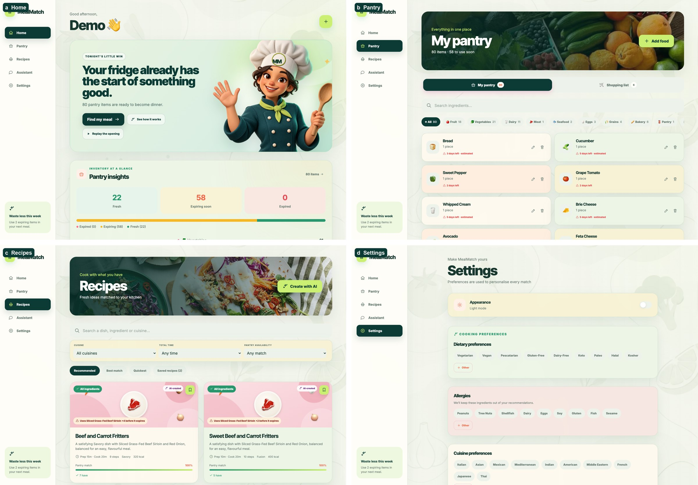

## 1.2 Problem context and motivation

Food waste is a national problem in Singapore: the National Environment Agency reported 790,000 tonnes of food waste in 2025, about 11% of all waste generated (National Environment Agency, 2026). Part of that waste starts at home, when food is forgotten at the back of a fridge, bought twice, or opened and left. Pantry-tracking applications exist, but their usefulness depends on an accurate inventory, and keeping one accurate by typing is tedious. The second problem is the decision itself. Repeated everyday choices impose a cognitive cost (Jiao, 2024); although that evidence comes from professional forecasting and transfers only loosely to cooking, it matches what my participants described. They forgot vegetables, sauces and opened dairy, bought duplicates, and struggled to combine unrelated leftovers into a meal.

MealMatch therefore attacks both costs together: it lowers the effort of recording food, and it turns the recorded pantry into a short, explained list of meals that use the most urgent food first.

The project changed considerably after the preliminary report. The preliminary prototype demonstrated one pipeline: Tesseract read a receipt, a language model extracted likely ingredients, and the user confirmed them before a hybrid search ranked a small set of seed recipes. The final system adds photograph and voice input, a 200-recipe collection, expiry-first ranking, guarded recipe generation, persistent cooking sessions and a shopping list. It also replaces two of the draft's model choices after evaluation. Chapter 5 shows that these changes followed evidence: benchmark results, pipeline measurements, and two rounds of user testing followed by three design iterations.

## 1.3 Research question

> To what extent can a human-in-the-loop, AI-orchestrated pantry and meal-planning system reduce the effort of pantry management while generating relevant, personalised and transparent recipe recommendations from ingredients that users already own?

## 1.4 Aims and objectives

- **O1: Reduce pantry-entry effort** through photograph, receipt and manual entry.
- **O2: Keep pantry data reliable despite AI uncertainty**: no model output is saved without human review.
- **O3: Support food-waste reduction** by surfacing food that is due soon and ranking recipes that use it first.
- **O4: Generate useful, personalised recipes** that respect diets, allergies, cuisines and time.
- **O5: Make recommendations understandable** through match percentages, missing items and reasons.
- **O6: Support cooking itself**, not only recipe choice, through step guidance, substitutions and hands-free voice control.

Each objective maps to evidence in Chapter 5. O1 is measured by acquisition time and correction counts, O2 by the confirmation logs and O3 by ranking tests. O4 draws on recommendation and generation feedback, O5 on interface features and participant requests, and O6 on hands-free command success and assistant ratings.

## 1.5 Contribution and originality

OCR, food recognition, embeddings and language models are established technologies, so the contribution lies in how I combined them. Four aspects are distinctive. First, a confirmation boundary separates probabilistic model output from the pantry, and every photo scan records the corrections the user made, so correction effort can be measured rather than assumed. Second, the ranking makes expiry decisive: a recipe that rescues food due tomorrow outranks a perfect pantry match that rescues nothing. Third, generation is guarded: generated recipes must pass diet, allergy, taste, title and repetition checks, and two high-risk food-safety questions are answered by deterministic rules instead of a model. Fourth, the project keeps a transparent evidence trail for every model choice, including a reversal: the detector that won the public benchmark failed in real kitchens and was removed.

## 1.6 Scope of the final application

The final version opens with a short film and a product tour (Section 3.3), then five persistent areas: **Home** (use-soon food, waste-impact estimates and suggestions), **Pantry** (search, categories, expiry and a shopping list), **Recipes** (search, filters, AI recipe ideas), **Assistant** (pantry-aware chat) and **Settings** (diets, allergies, cuisines, disliked foods, time and theme). Barcode scanning, user accounts and cloud deployment are outside the scope. MealMatch runs as a local web application on macOS, Windows or Linux with about 16 GB of memory, and its setup script installs every model at the version that was evaluated.

## 1.7 Report structure

Chapter 2 reviews the literature and existing products. Chapter 3 presents the design and how it changed across versions. Chapter 4 explains the implementation, quoting the most important code. Chapter 5 evaluates the models, the pipelines and the user studies, and critiques the project. Chapter 6 concludes.

# Chapter 2: Literature Review

## 2.1 Food waste and ingredient underutilisation

National statistics establish the scale of food waste but not its household causes (National Environment Agency, 2026). Van Herpen and de Hooge (2016) frame waste as a loss of remaining product utility and show that discarding usable products affects how consumers evaluate them; their study concerns product waste in general rather than a meal-planning intervention, so it motivates rather than validates an application like MealMatch. Its outcome is a further limitation: it measures how consumers judge a brand after wasting its product, not how much food households throw away, so it cannot show whether a tool like MealMatch would reduce waste. The practical lesson I drew is that telling people waste is undesirable is not enough: an effective tool must remove the barriers between owning food and using it. A pantry list that records expiry dates but never influences the next meal leaves the hardest step, deciding what to cook, to the user. I therefore treated expiry as a ranking signal and an interface signal rather than as stored metadata.

The national figure also hides variation between households. My participants described forgotten vegetables, herbs, dairy and opened ingredients, duplicate purchases and unused remainders, yet two (P04 and P09) rarely discarded food and expected more value from meal discovery than from waste reduction. The literature justified waste reduction as the primary aim but not as the only benefit, so I designed MealMatch to remain useful to households that waste little.

## 2.2 Decision burden and food recommendation

Jiao (2024) finds systematic decision-fatigue effects in analysts' earnings forecasts. The domain is far from cooking, and I use the study only to support the general claim that repeated choices carry a cost. Research on food recommenders is more directly relevant. Freyne and Berkovsky (2010) personalise recipe recommendations by breaking recipes into ingredients and inferring ingredient preferences, an idea MealMatch reuses when it matches recipes ingredient by ingredient. Trattner and Elsweiler (2017) review food recommenders and identify persistent challenges: taste is personal and changes, nutrition competes with preference, and user data is sparse at the start. Their critique warned me against presenting a single relevance score as "the best recipe". MealMatch instead shows a short ranked list with the reasons behind it, and leaves the choice to the user. Tintarev and Masthoff (2007) list transparency, scrutability and trust among the aims of recommender explanations. MealMatch's explanations aim at the first two: each card states why it ranks where it does, through its pantry match, the number of missing ingredients and the due-soon food it uses, and the user can check each reason against the pantry. They also warn that recommenders trained only on past choices can narrow what people cook. MealMatch has no learned taste model yet. This avoids that narrowing, but it also forgoes the personal learning that several participants wanted. Learning each user's taste from ratings and cooked meals is therefore future work (Section 6.5), and such a model should keep some unfamiliar recipes in every list so that it does not narrow what people cook.

## 2.3 Existing applications

Commercial products show which interactions users already know, and where they stop (Table 1). MyFitnessPal's Meal Scan and voice logging reduce the effort of recording what someone ate (MyFitnessPal, 2025; 2026a; 2026b). Cal AI estimates calories from photographs (Cal AI, 2026). Both answer "what did I eat?", whereas MealMatch asks "what do I own, and what can I make with it?". Mob offers chef-written recipes, ingredient search and shopping lists (Mob, 2026), and SuperCook builds recipes from a user-entered pantry (SuperCook, n.d.). SuperCook is the closest comparison, yet it relies on manual pantry construction, so its recommendations are only as current as the user's typing.

Table 1: Existing applications compared with MealMatch.

| Application | Primary purpose | Relevant automation | Gap MealMatch addresses |
|---|---|---|---|
| MyFitnessPal | Nutrition logging | Meal photo and voice logging | Logs consumption, not a persistent pantry |
| Cal AI | Calorie estimation | Photo, barcode and text input | Nutrition, not pantry-to-recipe decisions |
| Mob | Recipes and meal plans | Ingredient search, shopping lists | No AI-assisted, verified pantry |
| SuperCook | Cook from ingredients | Pantry-based matching | Manual pantry; no expiry-first ranking or verification |

These comparisons have limits. Product descriptions are marketing documents rather than evaluations, so I used them to identify interaction patterns, not to claim that the products perform poorly. They nevertheless show a consistent pattern: automation in commercial food applications concentrates on logging consumption or searching recipes, not on keeping a verified pantry current.

## 2.4 AI-assisted cooking and recipe planning

Benita et al. (2026) combine recipe scaling with an AI cooking assistant, treating quantities and in-cooking support as part of the problem. Ilyas, Shah and Sohail (2021) likewise treat quantity and time as practical constraints, although their system focuses on ingredient ordering and logistics. Budhiraja et al. (2025) use dietary and nutritional requirements as recommendation signals, and Malhan, Kumar and Rani (2025) describe AI-assisted recipe discovery. Samad et al. (2022) reviewed food-tracking applications and found that few combined advanced AI features with good overall software quality. Taken together, this work justifies personalisation and in-cooking assistance, but most systems assume that accurate ingredient data already exists before recommendation begins. That assumption is exactly where household use breaks down, so MealMatch invests heavily in acquisition and verification. The reviewed systems also say little about failure. Few report what happens when an assistant is wrong about quantities or food safety, even though in cooking a confident wrong answer can cause harm. This gap led me to test raw model behaviour on safety-critical questions before deciding what the assistant may answer.

## 2.5 Food recognition and multimodal acquisition

Food-101 showed how hard fine-grained dish recognition is (Bossard, Guillaumin and Van Gool, 2014). Ingredient recognition is harder still, because ingredients are occluded, packaged or transformed by cooking (Salvador et al., 2019). Recipe1M+ links over a million recipes with images (Marin et al., 2021), and Rokon et al. (2022) recommend recipes from detected ingredients. More recent systems pair vision with language models: Food-Lens analyses meals and generates recipes (Singh et al., 2024), and ARChef uses a multimodal model to identify ingredients and suggest meals (Vir and Madinei, 2024). These studies demonstrate feasibility on curated images; none measures how much correction a real household photograph needs. I treated that unmeasured gap as a design risk and made the correction step, rather than recognition accuracy alone, the object of evaluation. The evaluation practice in this literature is itself informative. Food-101 and Recipe1M+ measure accuracy on curated images, usually one dish per photograph, whereas a household photograph shows many foods at once, partly hidden and often identified only by packaging text. I therefore expected, and later confirmed, a large gap between benchmark and household performance (Section 5.4; Figures 21 and 22).

## 2.6 Open-vocabulary detection versus vision-language extraction

My image literature review shortlisted three detectors. YOLO-World v2 adds language prompts to a real-time detector so it can detect categories outside a fixed label set (Cheng et al., 2024). Grounding DINO grounds text in image regions through a transformer and targets stronger open-set performance at higher cost (Liu et al., 2024). RT-DETR is an efficient transformer detector, but its standard checkpoint has a closed vocabulary (Zhao et al., 2024), so it could not enter a fair zero-shot comparison; I screened it out for that reason rather than for accuracy. Open Images supplies human-verified boxes with official splits (Kuznetsova et al., 2020), which made a controlled benchmark possible.

Kuo et al. (2023) show the value of combining detector regions with frozen vision-language representations, which initially motivated a hybrid detector-plus-VLM design. Qwen2.5-VL reports recognition, localisation and structured extraction from one model (Bai et al., 2025). The two families also call for different metrics. Detectors output boxes with calibrated scores, which suit mAP and ranking measures such as NDCG, whereas a vision-language model returns an unordered list with self-reported confidence, which suits ingredient-level precision and recall. Published latencies usually assume server GPUs, so I measured latency on the target laptop instead of relying on reported speeds. The literature leaves an open question that mattered greatly for MealMatch: whether a benchmark measured on isolated public photographs predicts usefulness on crowded domestic scenes. Chapter 5 shows that, for this project, it did not.

## 2.7 Receipt OCR and structured extraction with language models

Tesseract remains a robust open-source OCR engine (Smith, 2007), but receipts mix products with prices, totals, codes and retailer abbreviations. My preliminary prototype confirmed that rule-based filtering became tied to specific receipts, while a free-form language-model prompt generalised better but introduced new errors. Language models can produce fluent but unsupported output, a problem Ji et al. (2023) survey as hallucination. My receipt prototype showed exactly this: the model invented a bottle of water and turned olives into olive oil (Figure 2). The literature therefore supports a division of labour in which code fixes what can be fixed deterministically and the model only interprets. This principle shaped the final receipt pipeline. Schema-constrained output offers a partial remedy: Ollama can force a model's answer to follow a JSON schema (Ollama, 2026), so the answer can at least be parsed and checked. Structure does not guarantee truth, which is why code still compares each name with the receipt text.

[[FIGURE-SLOT: Figure 2: Output of the preliminary receipt prototype: an invented bottle of water, and olives read as olive oil.]]

## 2.8 Local language and speech models

MealMatch runs its models locally for privacy and cost, which limits candidates to roughly 3–4 billion parameters. Llama 3.2 3B belongs to the Llama 3 family, designed partly for local and edge use (Dubey et al., 2024). The Qwen2.5 report emphasises structured and JSON output (Yang et al., 2024), which matters because MealMatch parses recipes and swaps as JSON. Phi-3 targets capable models small enough for devices (Abdin et al., 2024). For speech, Whisper's large-scale weak supervision aims at robust zero-shot recognition (Radford et al., 2023). Distil-Whisper trades some accuracy for speed (Gandhi, von Platen and Rush, 2023), and wav2vec 2.0 offers an architecturally different self-supervised CTC baseline (Baevski et al., 2020). General leaderboards cannot say which of these follows MealMatch's schemas or recognises "next step" in a noisy kitchen, so I evaluated them on task-specific benchmarks with rules frozen in advance. Quantisation matters as much as architecture in local deployment: Ollama's default 4-bit builds fit in a few gigabytes but may change behaviour, and the three text candidates used different 4-bit schemes (Q4_K_M and Q4_0). Speech has a similar trap, because word error rate does not show whether a transcript triggers the right action, so I scored command intent as well as transcription.

## 2.9 Semantic retrieval

Exact string matching treats "chicken breast" and "chicken" as different foods. Sentence-BERT produces sentence embeddings that can be compared efficiently (Reimers and Gurevych, 2019), and MiniLM distils such encoders into small models (Wang et al., 2020). FAISS supports fast nearest-neighbour search over dense vectors (Johnson, Douze and Jégou, 2019). Semantic similarity alone is not practical relevance, however: my prototype's embedding-only search returned unrelated recipes from a small database. The final design therefore uses embeddings to widen the candidate set, and deterministic ingredient matching to decide what the user actually has. For recipes, the lexical signal matters more than usual: a recipe is cookable only if the specific ingredients exist, and an embedding cannot tell whether a household owns chicken stock or merely chicken. Evaluating such a ranking has its own literature. Järvelin and Kekäläinen (2002) propose cumulated-gain measures such as nDCG, which reward relevant items placed early, and so suit a short list in which users rarely look past the first few recipes. These measures require graded relevance judgements for every pantry and recipe pair, a cost that I underestimated in the draft (Section 5.10).

## 2.10 Human–AI interaction, trust and accessibility

Amershi et al. (2019) propose guidelines for human–AI interaction, including making clear what a system can do, supporting efficient correction and scoping services when in doubt. These guidelines map directly onto MealMatch's confirmation lists, "Look closer" option and visible diet-conflict labels. The Human Interface and the Management of Information proceedings emphasise decision-support presentation (Yamamoto and Mori, 2021). WCAG 2.2 provides concrete accessibility success criteria (W3C, 2023), which I used as an audit checklist rather than as a claim of conformance. Several of its success criteria translate directly into MealMatch features: Use of Colour (1.4.1) into text labels beside every freshness colour, Contrast (Minimum) (1.4.3) into the dark-theme swap fix, Bypass Blocks (2.4.1) into a skip link, and Status Messages (4.1.3) into announced updates. Animation from Interactions (2.3.3) is an AAA criterion, yet it still justified honouring the reduced-motion setting in the opening film. Automation research adds a caution: people tend to over-trust automation that seems reliable and to abandon automation that seems unreliable (Parasuraman and Riley, 1997). A review screen that users rubber-stamp would not protect the pantry, so MealMatch shows each suggestion's confidence and the label text the model claims to have read, and it makes deleting and adding equally quick. Finally, Nielsen and Landauer (1993) show that small formative studies uncover many usability problems, which justifies iterative testing with about ten participants while cautioning against population-level claims.

## 2.11 Synthesis and research gap

The literature covers each part of MealMatch separately. Food-waste research motivates action, recommender research personalises ranking, vision and speech research supply capable models, and human–AI research argues for correction and control. Few systems connect all of these into one household workflow in which acquisition, verification, expiry, recommendation and cooking support operate on the same trusted pantry. The literature is also largely silent on whether benchmark-selected models remain useful in real homes. MealMatch addresses both gaps: it integrates the workflow end to end, and it evaluates each model twice, first on a controlled benchmark and then in real use. The review therefore also fixed how I would evaluate: component by component, in the target domain as well as on public data, and with the limits of each result stated. The sections above map onto the objectives: acquisition and trust research onto O1 and O2, recommender research onto O3 to O5, and cooking-assistant and speech research onto O6.

# Chapter 3: Project Design

## 3.1 Design overview and principles

MealMatch follows the template's premise that several specialised models, each doing one job, can achieve a goal that no single model reaches alone. Five principles guided every design decision:

1. **AI proposes, the user decides.** No model writes to the pantry; review screens sit between inference and storage.
2. **Local first.** Models run on the user's machine through Ollama and Python libraries, and uploaded images and audio are deleted after inference.
3. **Deterministic guards around high-cost errors.** Allergies, diets, food safety and voice navigation are handled by testable code, not only by instructions in a prompt.
4. **Evidence before adoption.** Each model is chosen by a rule fixed before testing, and later user evidence may overturn the choice.
5. **Every AI feature has a manual alternative.** Typing replaces photos and receipts, and buttons replace every voice command.

## 3.2 Users and requirements

The target users are students, busy young adults, beginner cooks and sustainability-minded households. Table 2 maps their needs, including those raised in testing, to design responses.

Table 2: User needs and design responses.

| Need or problem | Design response |
|---|---|
| Typing a pantry is tedious | Photo, receipt and manual entry converge on one review list |
| AI recognition is imperfect | Editable review with steppers, units and "add a missed ingredient" |
| Food is forgotten | Use-soon panel, expiry colours, recipes filtered to urgent food |
| Deciding what to cook is tiring | Short ranked list; three AI ideas for a craving |
| Diets and allergies | Allergies removed; diet conflicts listed last and labelled |
| Recommendations feel opaque | Match %, have/missing counts, "Uses X before it expires" |
| Hands are busy while cooking | "Hey Mimi" voice control with spoken steps; buttons kept |
| New users do not know the flow | Opening film and a ten-step tour on first load |

Non-functional requirements followed from the principles. Photographs, receipts and audio must be deleted after inference, no core model may need a cloud service, and a fresh clone must reproduce the evaluated model versions. Each model had eligibility gates set before testing: the photo model could fail on at most 5% of calls with a median latency of at most 45 s, the text model had to return valid structure and respect constraints in at least 90% of cases, and the speech model had to recognise at least 95% of clean and 85% of noisy commands. Every AI route also needed a manual alternative.

## 3.3 Information architecture and user journey

Figure 3 shows the final journey. The opening film sets the product's promise before any form appears. The tour then explains the Add → Check → Find → Cook sequence that a participant (P09) asked for. Five persistent areas separate recurring tasks, while the add-food sheet, the recipe page and cooking mode open in context. Two contextual links close the waste loop: "Use soon" opens Recipes filtered to the urgent foods, and "Meal is ready" removes the used amounts from the pantry.

The film and the tour answer a Round 2 finding: P04 was initially unsure whether MealMatch was a pantry or a recipe application, P10 understood the complete workflow only after exploring, and P09 asked for a short first-use sequence. The film states the promise in a few seconds of scrolling and can be skipped. The tour shows real screens with hotspots and opens by itself once per session, so returning users also see new features.

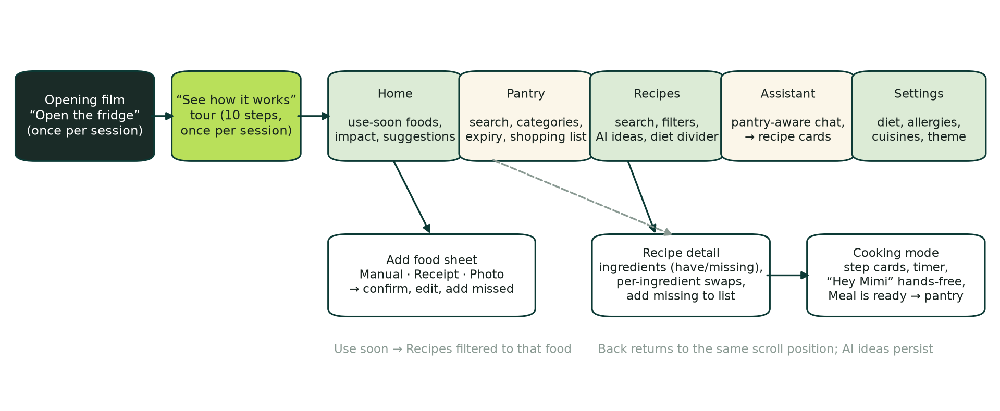

## 3.4 System architecture and data model

MealMatch uses a layered client–server architecture (Figure 4). React renders five screens and talks to FastAPI through JSON. FastAPI orchestrates the model services and writes AI-derived pantry data to SQLite only after user confirmation. I isolated each model behind a service function so that I could replace it after evaluation without touching the interface; this isolation later allowed me to swap the photo model from YOLO-World to Qwen2.5-VL with no change to the review screen.

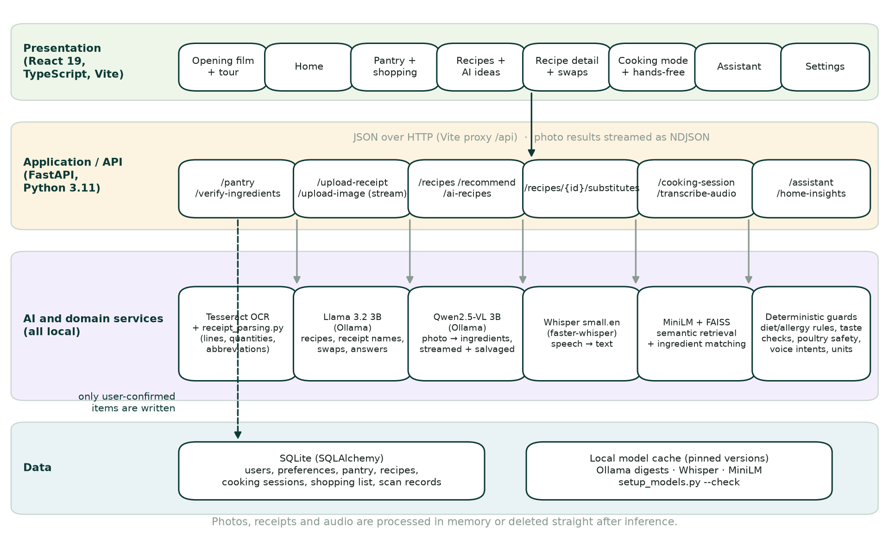

The data model (Figure 5) grew from the draft's seven tables to ten. Cooking sessions persist the current step, timings and a pantry snapshot so cooking survives a page reload. Shopping-list rows link missing items to their recipe, and each photo scan stores its correction counts and timings as evaluation data without keeping the photograph.

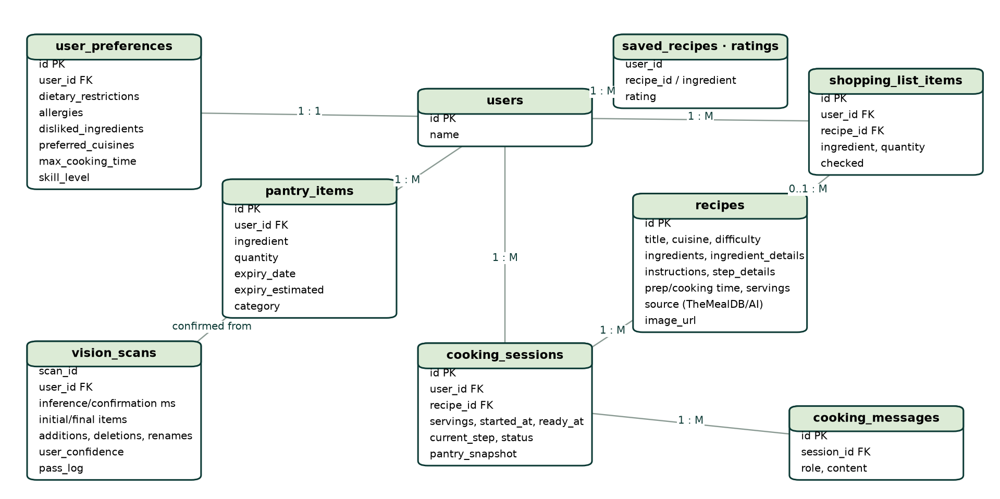

## 3.5 Multimodal ingredient acquisition

The three entry routes deliberately converge (Figure 6). Receipts suit a shopping trip, photographs suit a fridge check, and manual entry suits single items or corrections. Their errors also differ: receipts lose meaning through abbreviations, while photographs lose items through occlusion and packaging. A single review design, with quantity steppers, household units and a prominent "Add a missed ingredient" action, lets the user correct both kinds of error in the same way. I designed the list around correction speed because every participant raised quantity or unit editing. Steppers suit small counts, typing suits exact weights, and household units such as jar, box, carton and pack replace laboratory units. Each row keeps the receipt text or label the model read, so users can judge a suggestion without reopening the photograph.

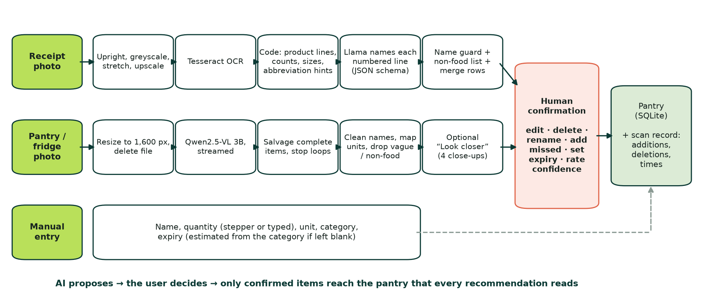

## 3.6 AI orchestration design

Table 3 assigns each model a narrow job and a guard. The design principle is that a model produces a proposal in a constrained format, and code decides what happens next. The voice assistant has a name, Mimi, which gives it a consistent identity and makes "Hey Mimi" a natural wake phrase. Its spoken replies avoid markdown, lists and abbreviations so that they sound natural through speech synthesis.

Table 3: Models, responsibilities and guards.

| Data space | Model | Job | Guard |
|---|---|---|---|
| Text | Llama 3.2 3B | Recipes, receipt names, swaps, answers | JSON schemas; diet, allergy, taste and repetition checks; poultry-safety rules |
| Image | Qwen2.5-VL 3B | Photo → ingredient list | Streamed parsing, name cleaning, unit mapping, human review |
| Audio | Whisper small.en | Speech → text | One-intent router; spoken confirmation to cancel |
| Retrieval | MiniLM + FAISS | Semantic recipe candidates | Deterministic ingredient matching decides availability |
| OCR | Tesseract | Receipt text | Code finds lines and quantities before any model runs |

## 3.7 Recommendation and personalisation design

The recommender separates safety from preference (Figure 7). Allergies are absolute: a conflicting recipe never appears. Diets are hard filters with a labelled fallback, so recipes that break a diet appear only after every recipe that fits, with the reason shown ("Not vegetarian · salmon"). Among the remaining recipes, ordering is lexicographic: diet fit first, then whether the recipe uses food due within five days, then a weighted score. This order encodes the app's purpose; an earlier score-only ordering allowed a complete pantry match that rescued nothing to outrank a recipe using food due tomorrow. Personal preferences stay soft: a preferred cuisine contributes 6% of the score and a time limit 4%. That is enough to reorder similar recipes but never enough to outweigh food that is about to expire.

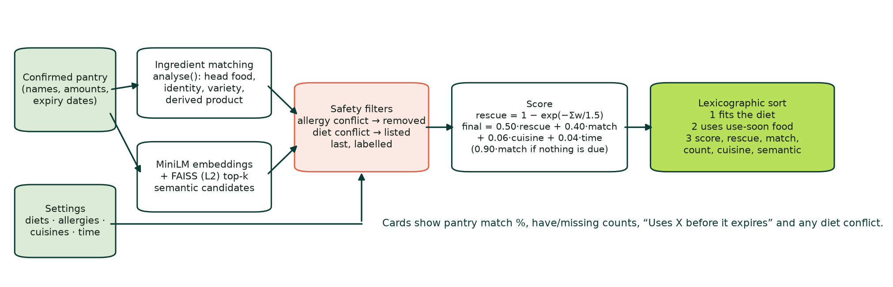

## 3.8 Interface and accessibility design

I designed for inclusion as well as appearance. Status never relies on colour alone: freshness, match and diet conflicts all carry text. The layout adapts from a desktop sidebar to a phone tab bar (Figure 10), a dark theme is available, and animations respect `prefers-reduced-motion`. A skip link, labelled navigation, `aria-live` status messages and native controls support keyboard and screen-reader use. Voice is optional, so users who cannot or prefer not to speak lose no function. I audited these features against a WCAG 2.2 AA-oriented checklist (W3C, 2023); I claim an accessibility-informed prototype, not conformance.

I organised accessibility around three complementary lenses. *Inclusive Design* considers different contexts and temporary constraints, such as messy hands while cooking, so every AI input is optional and every voice action has a button. *Born-Accessible Design* supplies concrete technical standards: semantic landmarks, native controls, visible focus, accessible names for icon buttons and charts, and `aria-live`, `aria-pressed` and `aria-expanded` to announce changes of state. *Radical Inclusion* asks whose food, language, home and resources the system assumes. It led to local processing, custom preferences beyond a fixed list, and an impact panel that counts food saved rather than food wasted, so the interface does not blame people for what they throw away.

Visual choices also carry meaning. The green palette of Version 3 signals freshness and reserves warm colours for urgency: amber marks food due soon and red marks food past its date. Alternating panel colours separate neighbouring cards without heavy borders, and cooking mode adopted the same panels after testers found its white cards monotonous. Emoji artwork replaced generated photographs because six of nine participants judged the photographs artificial, and because emojis derived from the ingredient list can never show food that the recipe does not contain.

## 3.9 Design evolution across versions

The interface went through three visual versions (Figures 8, 9 and 10). **Version 1**, in the preliminary report, placed every workflow on one long page with mocked image detection, and it asked the language model to explain each match in free text (Figure 8d). Later versions show fixed reasons computed by the ranking instead (Section 2.2). **Version 2** introduced the five-screen shell with a pink, serif, editorial style; its screenshots appear throughout Chapter 5 as evidence for the problems participants found. **Version 3** replaced the pink palette with a calmer green brand, a chef mascot for Mimi and a colour-coded panel system in which cream, sage, apricot and gold panels alternate. Four iterations then refined Version 3 in response to user testing (Section 5.9), and Figure 11 places these changes on the project timeline.

Each iteration answered specific evidence. *Iteration 1*, on the photo pipeline, changed how the app handles the model's answers rather than the model itself: it salvages cut-off lists, cleans brand names, maps units and makes close-ups optional. *Iteration 2* replaced the single AI recipe with three idea cards and rebuilt hands-free cooking around one intent per transcript. *Iteration 3* added taste-aware generation and replaced generated photographs with emoji artwork. It also recoloured the cooking and loading screens, kept the recipe list mounted so users return to the same place, kept AI ideas until cleared, and layered the swaps. *Iteration 4* made the tour open on first load and made dark-theme swap tags readable. The receipt pipeline went through two iterations of its own (Section 4.3). Appendix A adds further screenshots of each version.

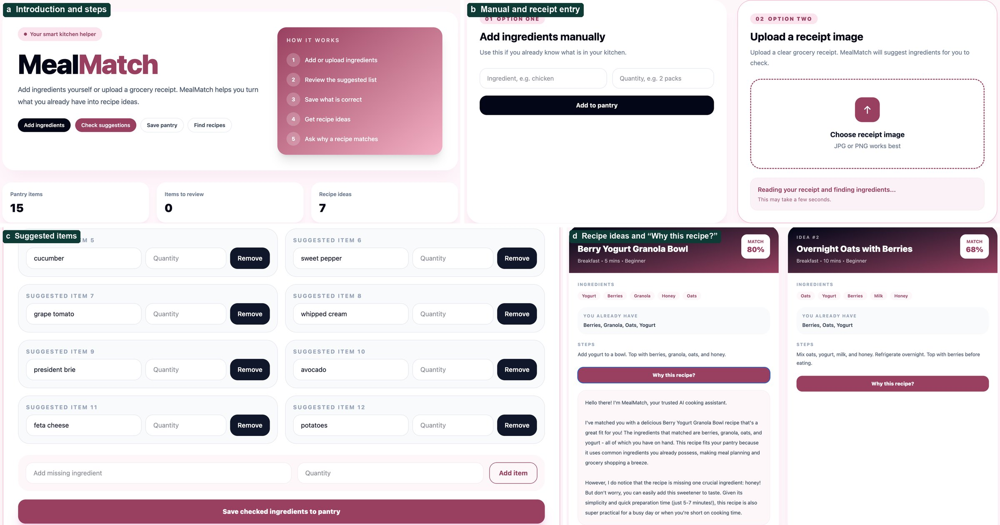

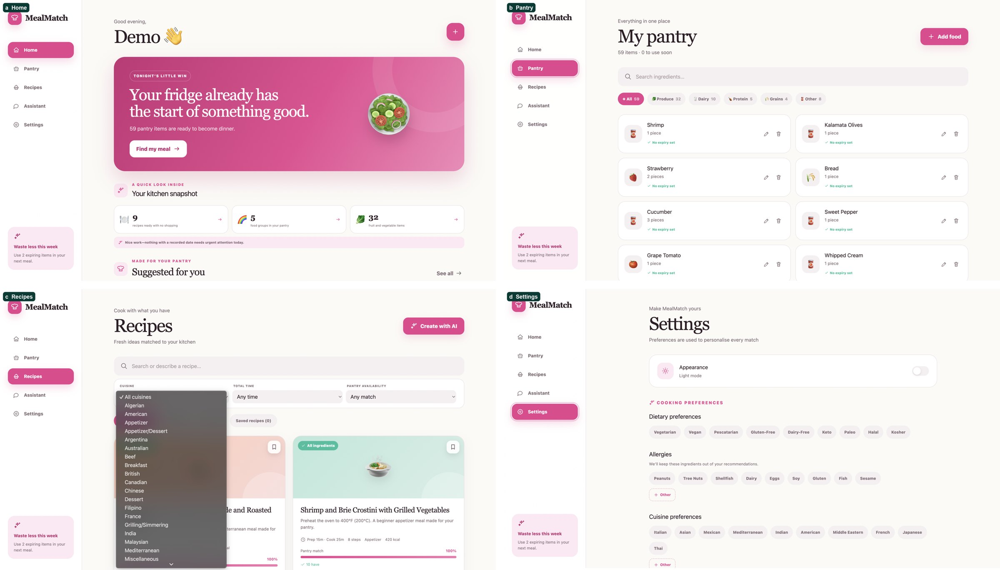

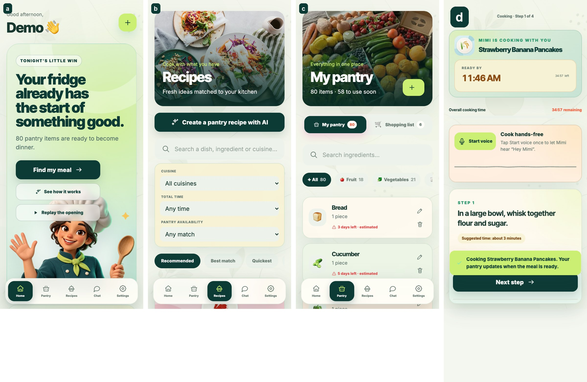

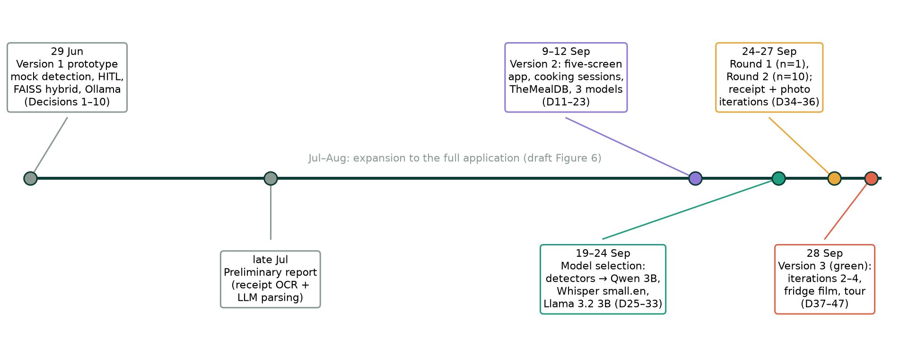

## 3.10 Technology selection

Table 4 records the main choices and the evidence behind them.

Table 4: Technology choices.

| Area | Options considered | Choice | Evidence |
|---|---|---|---|
| Backend | Flask, Express, FastAPI | FastAPI | Python AI libraries; automatic API docs |
| Storage | PostgreSQL, SQLite | SQLite | No server; enough for a local prototype |
| OCR | EasyOCR, Tesseract | Tesseract | EasyOCR crashed the server with a native library fault |
| Receipt parsing | Rules, free-form LLM, code + LLM | Code + LLM | Rules overfitted; free-form LLM invented items |
| Image model | YOLO-World, Grounding DINO, Qwen 3B/7B | Qwen2.5-VL 3B | Benchmark winner failed in homes; 7B broke the failure gate |
| Text model | Llama 1B/3B, Qwen2.5 3B, Phi-3.5 | Llama 3.2 3B | Practical tie with Qwen; faster |
| Speech | Whisper sizes, Distil-Whisper, wav2vec 2.0 | Whisper small.en | Only candidate to pass both noise gates |
| Recipe images | Generated photos, title cards, emojis | Ingredient emojis | Photo model held 5.7 GB and took ~10 s each |

## 3.11 Risks and contingency

The draft's risk plan proved useful because several risks materialised (Table 5).

Table 5: Risks that materialised and the responses.

| Risk | What happened | Response |
|---|---|---|
| Photo recognition incorrect | Benchmark-selected detector failed on real fridges | Replaced by Qwen2.5-VL; review kept mandatory |
| Local model slow or heavy | 7B vision timed out; image generator used 5.7 GB | Chose 3B; removed image generation |
| OCR unreliable | EasyOCR crashed; abbreviations missed | Tesseract plus code parsing |
| Unsafe model advice | Both 3B text models gave unsafe poultry answers | Deterministic safety answers |
| Scope growth | Film, tour and impact features competed for time | Core flows tested first; extras added last |

## 3.12 Evaluation strategy

Each objective has its own evidence (Chapter 5). Model choices use frozen, task-specific benchmarks. Pipelines are measured on real photographs and receipts, and design is tested formatively with participants and then iterated. Software quality is covered by unit, integration and system tests. I planned an offline Precision@5 study for recommendations in the draft but did not build the relevance judgements it needs (ratings of how well each recipe suits each test pantry); Chapter 5 discusses this gap openly.

# Chapter 4: Implementation

## 4.1 Overview

The project uses the CM3020 *Orchestrating AI models to achieve a goal* template. The application comprises a React 19 and TypeScript front end (about 4,100 lines of TypeScript plus stylesheets), a FastAPI back end (about 6,300 lines across 29 modules) and evaluation code for each model family. It has 101 back-end and 8 front-end automated tests. `setup_models.py` installs every model at the exact version that was evaluated, by checking Ollama manifest digests and Hugging Face commits, so that a fresh clone reproduces the evaluated system. It pulls only missing Ollama models, because pulling an installed tag again could silently replace an evaluated build. It downloads Whisper and MiniLM at fixed commits (87 MB instead of 912 MB by skipping unused formats), and it stops with a clear message when run from the wrong Python environment. The back end separates HTTP routes (`routers/`, one module per part of the app, with start-up and the health check in `main.py`) from database helpers (`pantry_store.py`, `recipe_store.py`, `preference_store.py`), from model services (`ai_services.py`, `model_services.py`, `ocr_services.py`) and from deterministic logic (`receipt_parsing.py`, `vision_suggestions.py`, `ingredient_matching.py`, `recipe_relevance.py`, `recommender.py`, `substitutions.py`, `pantry_usage.py`), so each part can be tested alone.

## 4.2 Front end

The front end is a single-page application with a persistent shell: a sidebar on desktop and a tab bar on phones. I kept its state in one `App` component because pantry, recipes, cooking and chat constantly affect one another; each screen is its own module that receives that state. For example, finishing a meal must refresh the pantry, the recommendations and the impact panel together. Requests pass through a Vite proxy so that they stay same-origin in development. The same food-name rules exist in TypeScript (`recipeFilters.ts`), so the client's "in pantry" marks agree with the server, and recipe search expands food families, so "pasta" also finds spaghetti and penne. The theme is a `data-theme` attribute on the root element, remembered in local storage, and dark-theme rules override the light palette component by component. Other state persists only as long as it is useful. The opening film and the tour are marked as seen for the browser session, AI ideas last for the session, and the assistant keeps its last 30 messages until the user clears them.

Two navigation problems found in testing shaped the structure. Opening a recipe used to replace the whole screen, so returning lost the scroll position and any AI ideas on the page. The screen now stays mounted, hidden, beneath the recipe, and a layout effect restores the saved scroll position when the user goes back. AI ideas are held by the app rather than the page, and are stored in session storage through a small hook (Listing 1) so that they survive tab switches and reloads until the user clears them.

Listing 1: State that survives reloads, used for AI ideas and assistant recipe cards (`storage.ts`).

```tsx
export function useStoredState<T>(key: string, initial: T, where: "session" | "local") {
  const [value, setValue] = useState<T>(() => {
    try {
      const saved = readStorage(key, where);
      return saved ? JSON.parse(saved) as T : initial;
    } catch { return initial; }
  });
  useEffect(() => writeStorage(key, value === null ? null : JSON.stringify(value), where), [key, value, where]);
  return [value, setValue] as const;
}
```

The opening film (Figure 12) uses GSAP ScrollTrigger to drive a single camera through a closed fridge, an opening door, drifting ingredients and a finished dish. I optimised it after measuring dropped frames: light layers are drawn at reduced resolution, blurs are pre-rendered and images are decoded before playback. After the film, the product tour opens once per browser session (Figure 13), whichever screen the app starts on.

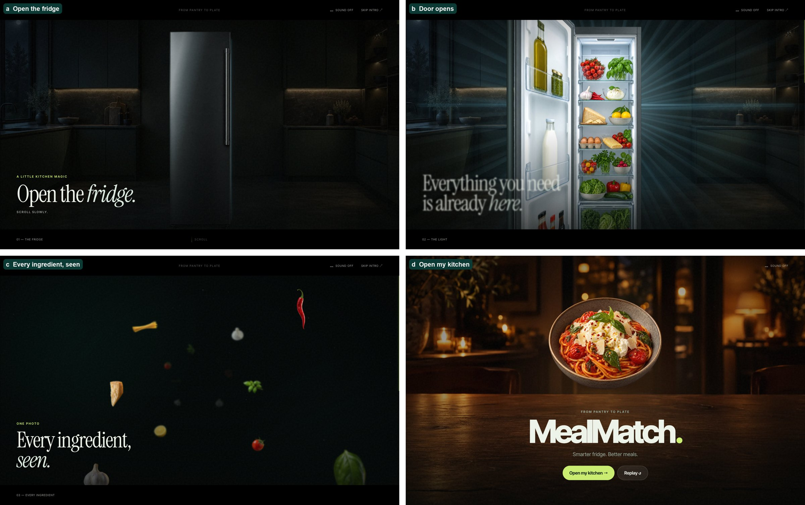

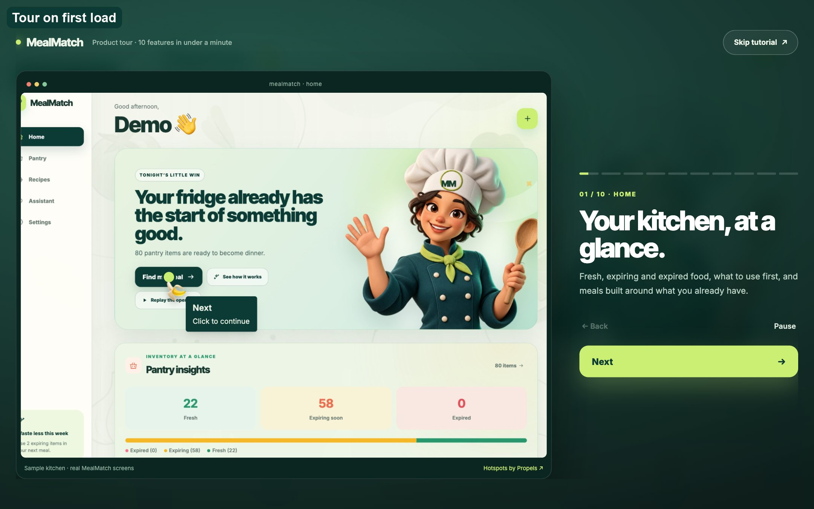

## 4.3 Receipt pipeline

The receipt pipeline divides work between code and Llama 3.2 3B. The image is straightened, converted to greyscale, contrast-stretched and upscaled to about 2,000 pixels before Tesseract reads it. `receipt_parsing.py` then keeps only product lines, counts repeated lines, and reads stated quantities (`3 @ 1.29`), weights and pack sizes. It also expands abbreviations through a 102-entry table, OCR letter swaps and a "vowel skeleton" match, so that `BRKFST` becomes breakfast. The model receives numbered lines with those hints and must answer a JSON schema with one required key per line (Listing 2). Because the keys are fixed, it can neither skip a line nor invent one. A name guard restores words the model dropped (so whole and skim milk stay separate), a whole-word denylist removes non-food products, and identical items merge into one row that shows its source text, for example *On receipt: "ARTISAN BGT ×3"*. The model runs at temperature 0 with a fixed seed and a capped output length, so the same receipt always yields the same rows; the earlier prompt ran at the default temperature and could vary between runs. Figure 14 shows the participant receipt that drove this redesign.

Listing 2: One required key per receipt line, so the model cannot add or skip lines (`ai_services.py`).

```python
def receipt_schema(lines: list[ReceiptLine]) -> dict:
    answer = {"type": "object",
              "properties": {"receipt": {"type": "string"}, "ingredient": {"type": "string"},
                             "food": {"type": "boolean"}},
              "required": ["receipt", "ingredient", "food"]}
    keys = [str(line.number) for line in lines]
    return {"type": "object", "properties": {key: answer for key in keys}, "required": keys}
```

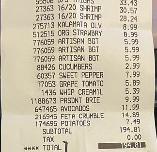

## 4.4 Photo pipeline

The photo route sends one image to Qwen2.5-VL 3B through Ollama and streams its answer. Diagnosis in Round 2 showed that crowded photographs made the model hit its output limit mid-item, and the original code, which parsed the answer as one JSON object, discarded the whole list. Listing 3 recovers every complete item instead, and a companion check stops an answer that begins repeating itself.

Listing 3: Recovering complete items from a cut-off answer (`vision_suggestions.py`).

```python
def salvage_items(raw: str) -> list[dict]:
    decoder, items = json.JSONDecoder(), []
    index = raw.find("[")
    while index >= 0:
        start = raw.find("{", index)
        if start < 0:
            break
        try:
            item, index = decoder.raw_decode(raw, start)
        except json.JSONDecodeError:
            break
        if isinstance(item, dict):
            items.append(item)
    return items
```

Code then removes brand and marketing words (*meiji milk* becomes milk), maps product names to foods (*Cadbury Dairy Milk* becomes chocolate) and translates the model's units into the form's units (*loaf* becomes pack). An optional "Look closer" button re-runs the prompt on four overlapping close-ups; I made it optional after the frozen test showed that close-ups added mostly wrong items (Section 5.5). The photo file is deleted before inference, and results stream to the review list as NDJSON, so review begins as soon as the first pass finishes (Figure 15a). The model stays loaded for five minutes after a scan and starts loading when the Photo tab opens, which hides most of its 1.4-second load time.

## 4.5 Human-in-the-loop confirmation

The review list is the same for photos and receipts. Each row has a name, a quantity stepper that also accepts typing, a household unit and an expiry date that the app estimates from the category when left blank. The estimates are deliberately cautious: two days for meat and seafood, seven for fruit, vegetables and dairy, 21 for eggs and 180 for dry pantry staples. Rows show the model's confidence and any label text it read. When the user confirms, the app posts only the final list to `/verify-ingredients`. The scan record stores the initial suggestions, additions, deletions, renames, timings and an optional 1–5 confidence rating, which provides the measurements used in Chapter 5 without retaining the photograph. The impact panel (Figure 15b) later counts food cooked before its expiry date and estimates the weight and CO₂e saved, using a conservative factor of 2.5 kg CO₂e per kilogram of food.

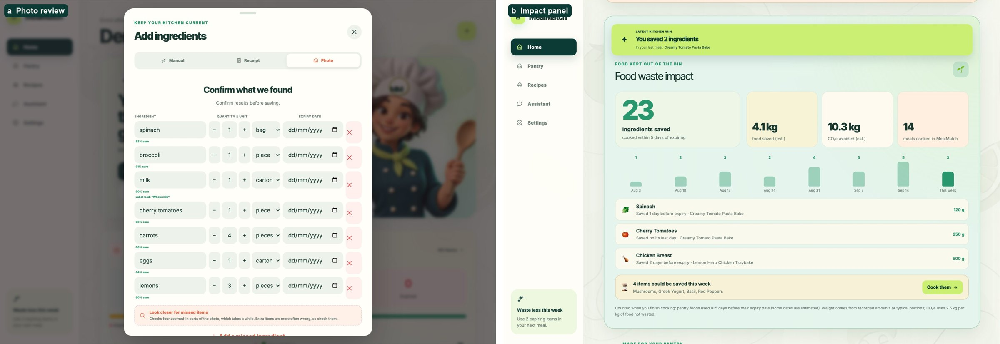

## 4.6 Recommendation engine

Recommendation combines two retrieval paths. MiniLM encodes every recipe, and FAISS (`IndexFlatL2`) returns semantic neighbours of the pantry. The index is rebuilt only when the recipe set changes. `ingredient_matching.analyse()` reduces each food name to a head food, identity modifiers (so coconut milk is not milk), varieties and derived products (so chicken stock is not chicken). Availability is decided by this deterministic matching, never by embedding similarity. For example, "boneless skinless chicken thighs" reduces to the head food chicken with the cut removed, so it matches a pantry "chicken"; "chicken stock" reduces to chicken with the derived product stock, so it does not. Dietary rules use broader word groups, such as every meat and fish term for vegetarians, with explicit look-alike exceptions such as peanut butter, coconut milk and buckwheat, because for safety a false alarm is preferable to a miss.

Scoring rewards rescuing food that is due soon. Each use-soon food the recipe uses contributes an urgency weight w(d) = (6 − d)/6, where d is the number of days until expiry, and the rescue score saturates as 1 − exp(−Σw/1.5) (Figure 16). When use-soon food exists, the final score is 0.50·rescue + 0.40·match + 0.06·cuisine + 0.04·time; otherwise match carries 0.90. The sort key in Listing 4 then enforces the product's priorities.

Listing 4: Lexicographic ordering (`recommender.py`).

```python
def recommendation_sort_key(score_details):
    return (score_details["dietary_conflict"] is None,          # fits the diet
            bool(score_details["expiring_matched_ingredients"]), # uses food due soon
            score_details["final_score"], score_details["rescue_score"],
            score_details["ingredient_match_score"], len(score_details["matched_ingredients"]),
            score_details["cuisine_score"], score_details["semantic_score"])
```

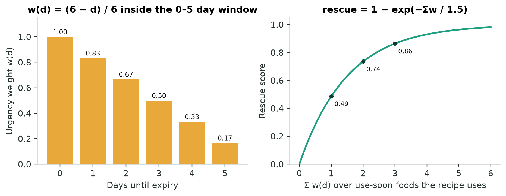

## 4.7 AI recipe generation

Recipe generation (Figure 17) is a loop of proposal and verification. The request is first interpreted. Compound foods such as "ice cream" stay whole, and taste words set what the dish must taste like unless they belong to a food's name ("sweet potato", "sweet chilli"). A request naming a savoury food ("sweet and sour chicken") describes a sauce, not a dessert. Listing 5 shows this logic, which I wrote after a request for "a sweet dish with what I have in my pantry" produced beef fritters because "sweet" had been treated as a filler word.

Listing 5: Reading the taste a request asks for (`recipe_relevance.py`).

```python
def request_flavour(request: str) -> str | None:
    tokens, terms, tastes = _tokens(request), request_terms(request), _asked_tastes(request)
    if "savoury" in tastes:
        return "savoury"
    if set(terms) & SWEET_DISHES or any(f"{a} {b}" in SWEET_DISHES for a, b in zip(tokens, tokens[1:])):
        return "sweet"
    if set(tokens) & SOMETIMES_SWEET and set(tokens) & SWEET_FOODS:
        return "sweet"
    if "sweet" in tastes and not any(is_savoury_food(term) for term in terms):
        return "sweet"   # "something sweet" is a dessert; "sweet and sour chicken" is not
    return None
```

Next, the app chooses which pantry foods to offer. Foods that frequently appear in reference dishes similar to the request score highest. A general sweet request instead receives the sweet foods that expire soonest plus dessert basics. Llama then returns recipe JSON, which must pass checks for schema, ingredient count, diet, allergy and taste, and must not name a pantry food in its title that the ingredient list omits. It must also not repeat an idea already shown, or, for "what I have" requests, need more than two foods to buy. A failed check adds its reason to the next prompt, for up to three attempts. Repeats are detected by comparing title words and main ingredients (at least 75% overlap). An earlier recipe with the same name and similar ingredients is reused rather than saved twice, which removed duplicate cards from the collection. The three ideas appear as text cards, and each recipe page shows its main ingredients as emojis on a plate instead of a generated photograph (Figure 18).

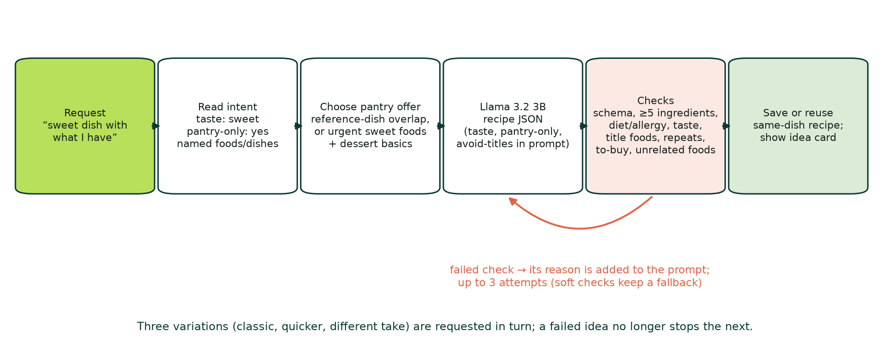

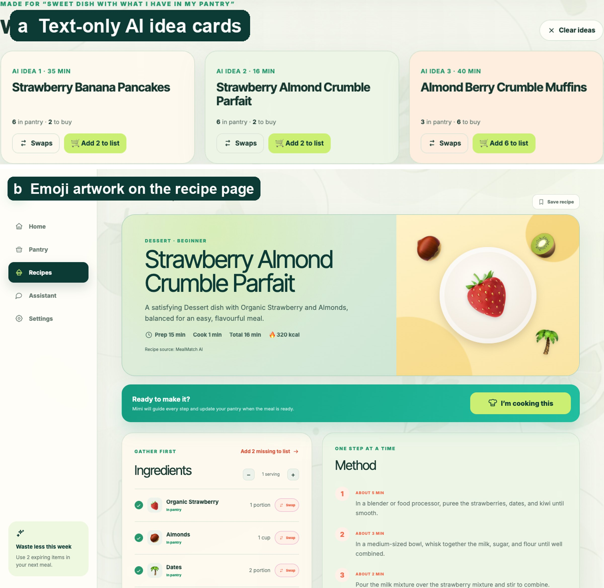

## 4.8 Ingredient swaps

Swaps are fetched for the ingredient the user taps, in three layers: pantry foods of the same kind, then a table of standard substitutions for 113 foods (each with how to use it), then Llama, told the dish, only when fewer than three swaps are found. Cheeses swap only within their kind, so feta is never offered for parmesan, and products are never swapped like their source food, so chicken stock does not suggest turkey. Every suggestion passes the allergy and diet checks. Missing ingredients that the user cannot swap go to the shopping list. Each row remembers the recipe it came from, so a user can tick items off, remove one, or remove a whole recipe's items when they change their mind. In the dark theme, all swaps share one card colour and differ only in their tag: green for "In pantry" and amber for "Alternative" (Figure 19).

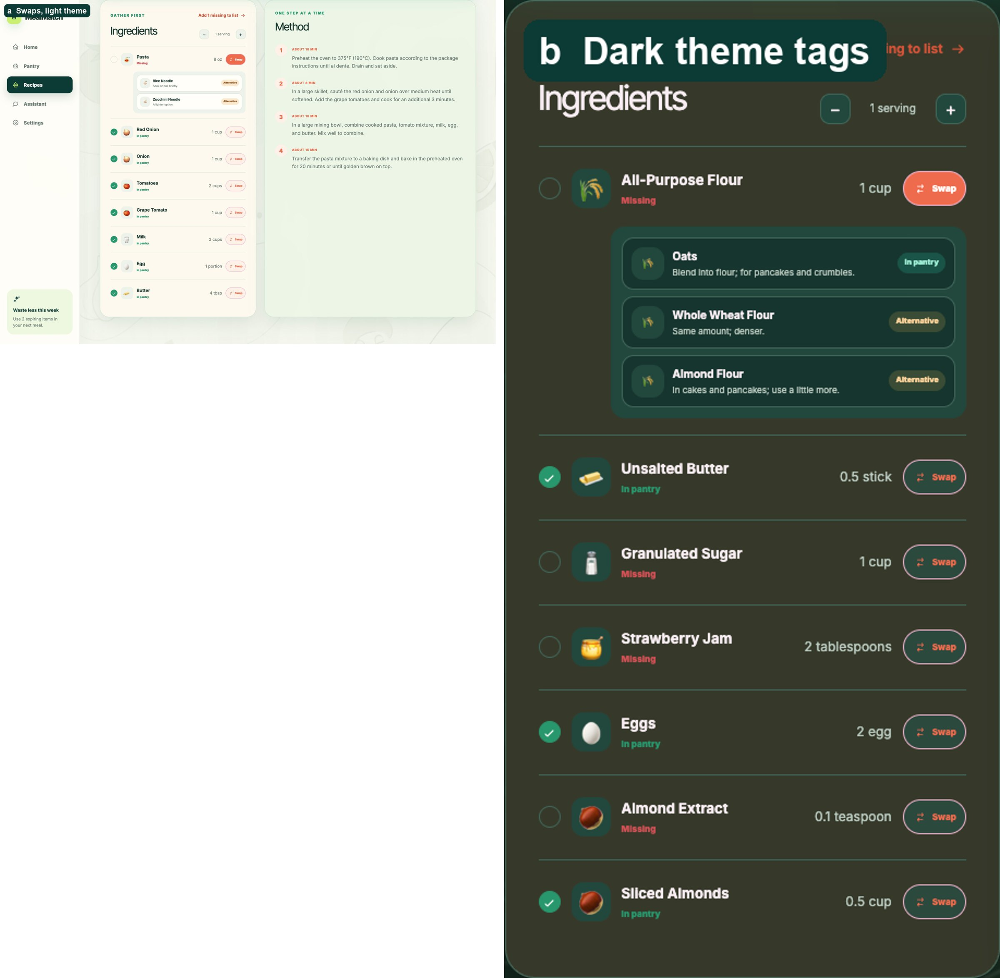

## 4.9 Cooking mode and hands-free voice

Starting a recipe creates a persistent cooking session with a timer, step cards and an assistant thread (Figure 20). After the user says "Hey Mimi" (detected by the browser's speech recogniser) or taps Start voice, the browser's audio analyser ends each utterance after a pause and uploads it to `/transcribe-audio`. Whisper transcribes it there, and the recording is deleted immediately. `voiceCommands.ts` maps each transcript to exactly one intent: next, previous, go to step *n*, repeat, time, help, stop listening, finish, cancel or question. As a result, the spoken reply and the on-screen card always agree. On the final step, "done" or "the meal is ready" finish the meal, just as the button does. Open questions go to Llama with the recipe and current step as context, and the browser reads replies aloud with the best installed English voice. Listing 6 shows how an intent becomes one visible action.

The wake listener proved fragile in testing. React's development mode mounts components twice, so two listeners restarted and interrupted each other, and a refused microphone silently disabled the feature. The rebuilt listener stops for good when removed, accepts common mishearings such as "hey mimmy", falls back to US English and explains a refused permission. Cooking sessions persist in SQLite with their start time, current step and messages, so a reload resumes the same step and timer, and only one session can be active at a time.

Listing 6: One intent, one visible action (simplified from `screens/CookingMode.tsx`).

```tsx
const intent = cookingIntent(transcript, onFinalStep);
switch (intent.kind) {
  case "finish":
    if (onFinalStep)                              // the same as pressing "Meal is ready"
      return { response: "Your meal is ready. Enjoy! I've updated your pantry.", stopListening: true, afterSpeech: onComplete };
    setPendingVoiceConfirmation("finish");        // steps remain, so ask first
    return { response: `You still have ${lastStep - currentStep} steps to go. Say confirm finish to finish now, or say never mind.` };
  case "next": {
    const nextStep = currentStep + 1;
    await moveToStep(nextStep);                   // the card moves before Mimi speaks
    return { response: `Step ${nextStep + 1}. ${stepDetails[nextStep].instruction}` };
  }
  /* previous, goto, repeat, time, help, stop-listening, cancel … */
}
```

When the meal is ready, `pantry_usage.py` subtracts the amounts used, converting units through typical weights, densities and package sizes. For example, one cup of milk taken from a one-litre bottle leaves about 0.8 of a bottle. Amounts that cannot be converted are left unchanged rather than guessed.

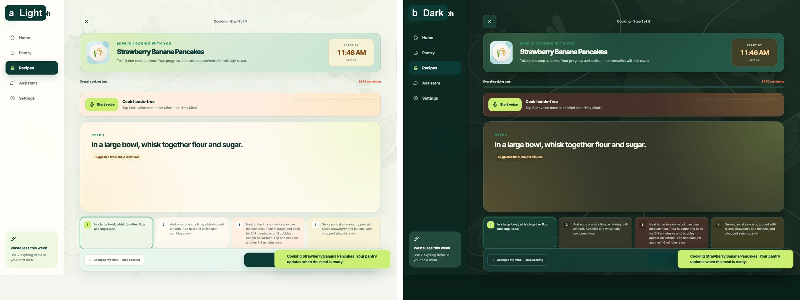

## 4.10 Assistant and deterministic safety

The assistant answers pantry-aware questions and can turn a request into three recipe cards saved to Recipes. Text-model testing revealed that both eligible 3B models gave unsafe poultry advice (Section 5.7). I therefore intercept explicitly labelled poultry-temperature and raw-poultry-washing questions before any model call, answering them from FoodSafety.gov and CDC guidance (FoodSafety.gov, n.d.; Centers for Disease Control and Prevention, 2024) (Listing 7).

Listing 7: Deterministic poultry-temperature answer (excerpt, `ai_services.py`).

```python
threshold = 74.0 if is_celsius else 165.0
if value < threshold:
    return f"Not yet. Poultry should reach at least {display_threshold} in its thickest part before serving."
return f"That meets the minimum of {display_threshold}; check the thickest part with a clean food thermometer."
```

## 4.11 Testing and quality assurance

Unit tests cover ingredient matching, receipt parsing, photo-answer salvage, recommendation scoring, diet and allergy rules, taste checks, swaps, unit conversion and the voice router. Integration tests run the API against a temporary SQLite database with every model mocked, covering photo streaming, the recipe safety and retry loop, and pantry deduction. A browser system test adds and deletes a pantry item through the full stack. All 101 back-end tests, all 8 front-end tests, the type check and the production build pass.

## 4.12 Assessment of the implementation

The implementation achieves the complete Acquire → Verify → Prioritise → Recommend → Explain → Cook loop, and each model is replaceable behind its service. Its weaknesses are acknowledged in Chapter 5. Photo recall remains low on dense scenes, the text benchmark is small, and parts of the matching and taste logic are word lists that need maintenance. Measured against its goals, the implementation is strongest in its guarded pipelines and weakest where it depends on open-ended perception. The most valuable next improvements are a hosted option for the larger 7B vision model, a larger receipt set from unseen stores, and per-attempt logging for voice that records each transcript, intent and card state.

# Chapter 5: Evaluation

## 5.1 Strategy and justification

MealMatch combines several AI components, and each fails in a different way, so no single metric could evaluate it. I therefore triangulated four kinds of evidence:

1. **Model-selection benchmarks** with eligibility rules fixed before testing, so that I could not choose thresholds after seeing results.
2. **Pipeline tests** on real photographs and receipts, measuring precision, recall and corrections against recorded ground truth.
3. **Formative user studies** (Round 1 with one participant; Round 2 with ten), followed by re-tests with the same cohort after each design iteration.
4. **Software tests** at unit, integration and system level.

Every figure in this chapter is measured and traceable to the repository, and I report missing measures as missing rather than estimating them.

## 5.2 Success criteria and overall results

Table 6 compares the results with targets that I set before Round 2 and with each model's eligibility gates.

Table 6: Success criteria and results.

| Measure | Target | Result | Status |
|---|---|---|---|
| Image model: failures, median latency | ≤5%, ≤45 s | Qwen 3B: 0%, 7.2 s | Met |
| Text model: structure, constraint safety | ≥90%, ≥90% | Llama 3B: 100%, 100% | Met |
| Speech: clean, noisy intent | ≥95%, ≥85% | Whisper: 98.1%, 92.6% | Met |
| Photo precision / recall (real scenes) | 0.85 / 0.80 | 0.78–0.82 / 0.47–0.60 | Not met |
| Corrections per photo | ≤20% of items | 73% and 87% | Not met |
| Receipt non-food exclusion | ≥95% | 11/11 removed | Met |
| Receipt repeated quantities | All correct | All 49 rows correct after fixes | Met (tuned) |
| Hands-free intent success | ≥90% | 70/70 (tally) | Met (formative) |
| Voice/display synchronisation | 100% | Failed in Round 1; all attempted phrases passed on re-test | Met after iteration |
| SUS | ≥68 | Not administered | Not assessed |

## 5.3 Software testing

Section 4.11 describes the test suite: 101 back-end tests, 8 front-end tests, a type check, a production build and a browser system test. Listing 8 shows both suites passing on the final code. The tests also served as regression guards during iteration. For instance, the sweet-request fix added tests proving that "sweet corn soup" and "sweet and sour chicken" stay savoury. The voice-router tests cover more than 30 phrasings, including natural variants of "next", last-step finishing, navigation, questions and wake-word mishearings. Speech recognition itself cannot run in automated tests, so the participant sessions remain its only real-world evidence.

Listing 8: Final test run, back end then front end, with the back-end tests counted by module.

```text
$ python -m unittest discover -s backend/tests -t .
Ran 101 tests in 0.233s
OK

  recipes_and_cooking     22   vision_suggestions      17   receipt_parsing          11
  text_model_evaluation    9   photo_workflow           6   impact_and_relevance      5
  qwen_evaluation          5   qwen_vision              5   household_labeller        4
  whisper_evaluation       4   ingredient_matching      3   qwen_public_evaluation    3
  vision_metrics           3   asr_model_evaluation     2   vision_dataset_tools      2

$ npm test
✔ search requires the food itself, not a product made from it or a substring
✔ food families and multi-word foods
✔ total time preserves zero prep and trusts the stored total
✔ pantry matching handles qualified names without matching different foods
✔ any phrase with 'next' moves the step card (round 2 finding)
✔ on the last step, finishing words match the Meal is ready button
✔ other commands and questions
✔ wake phrase variants and confirmations
ℹ tests 8
ℹ pass 8
ℹ fail 0
```

## 5.4 Image model selection and the benchmark reversal

I first compared YOLO-World v2 and Grounding DINO Tiny zero-shot on a frozen Open Images subset of 3,165 images across 27 food classes, with no image overlap between splits. Thresholds were selected on validation data only. Grounding DINO won clearly (test mAP@0.50 0.181 against 0.057), but at 571.7 ms per image against 31.2 ms. Because latency mattered for an interactive app, I fine-tuned YOLO-World for 20 epochs; it reached mAP@0.50 0.244, precision 0.399 and F1 0.335 at 24.7 ms (Figure 21). A 500-sample paired bootstrap placed its mAP@0.50 advantage over Grounding DINO between +0.026 and +0.108 (Efron and Tibshirani, 1993), so I deployed it.

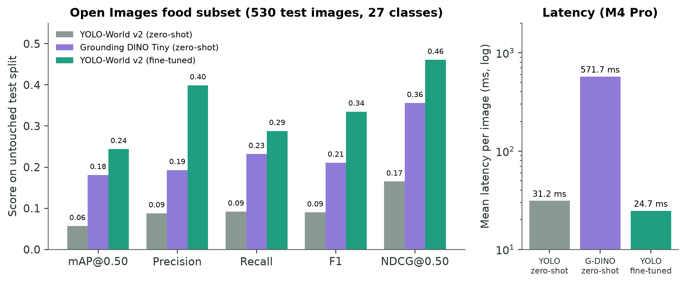

Real kitchens overturned that decision. On users' refrigerator and grocery-table photographs, like those in Figure 24, the detector often returned one or two items and predicted bananas where none existed; on a cluttered table it found only pineapple and banana, and lowering the threshold merely duplicated them. The benchmark had measured 27-class box detection on isolated objects, whereas MealMatch needs open-ended extraction from dense scenes, often through package text. I removed YOLO from the application, kept its evidence, and compared Qwen2.5-VL 3B and 7B on a frozen household set of 35 independently labelled photographs, running each image three times (Figure 22). The 7B model found more items (F1 0.253 against 0.219), but 7 of its 105 calls timed out, a 6.7% failure rate above the predeclared 5% ceiling, and its median latency was 44.7 s against 7.2 s. The paired F1 difference (−0.023 to +0.087) crossed zero. The 3B model was the only eligible candidate. A later public check reversed the ranking again (7B F1 0.857 against 0.411). I report this as evidence that model rank depends on the data distribution and operating conditions, not as a reason to change the household decision.

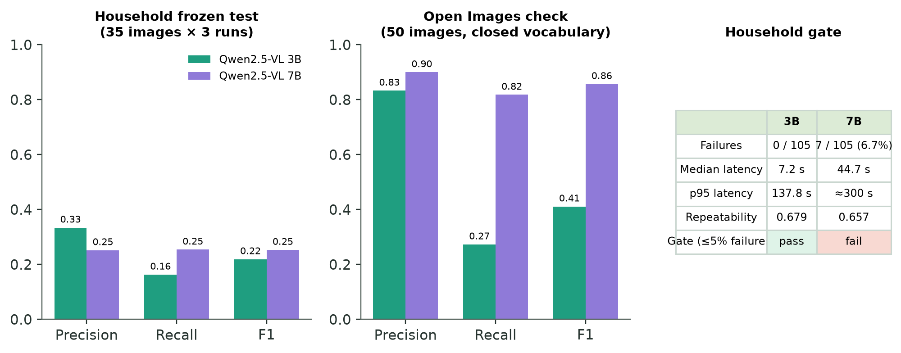

## 5.5 The photo pipeline in use

Round 2 tested the selected model on a controlled eight-item photograph (three runs) and on a participant's refrigerator and grocery table, 15 items each (Figures 23 and 24). Precision was acceptable (1.00, 0.82 and 0.78), but recall fell as scenes grew fuller (0.67, 0.60 and 0.47), and 73–87% of ground-truth items needed a correction, far above the 20% target. Diagnosis found faults in the pipeline, not only in the model. Answers were cut off and discarded, the model listed only about 8–13 foods per image, brand names were taken literally, and unknown units appeared as "piece".

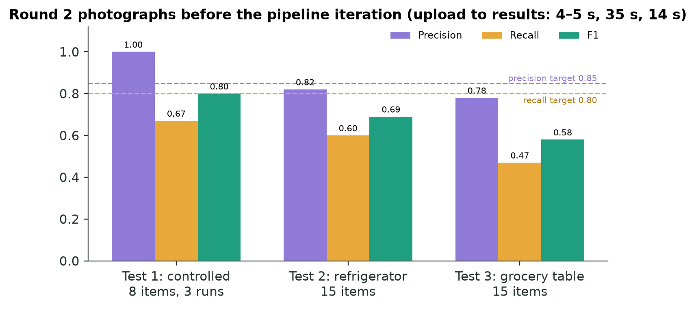

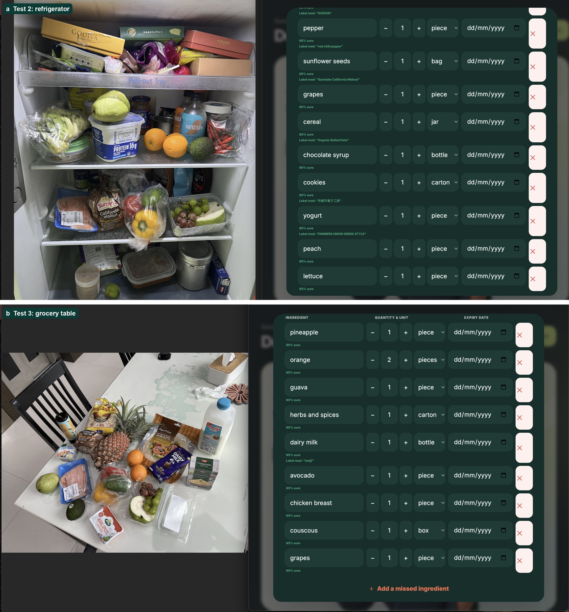

I kept the model, prompt and threshold, and changed only how the app handles answers (Section 4.4). On the frozen test, run once after the design was settled, whole-photo F1 rose from 0.219 to 0.279 (paired difference +0.060, 95% CI +0.009 to +0.121), and empty results halved (Figure 25). Close-ups nearly doubled recall, to 0.317, but only 25 of their 214 additions were correct, so I made them an optional "Look closer" action. The frozen test is no longer blind for pipeline changes, and I record this rather than reuse it silently.

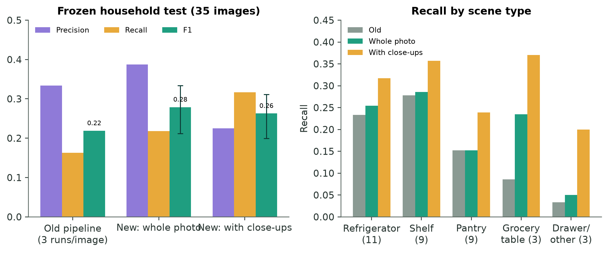

Speed improved substantially from the user's viewpoint. Round 2 participants reported analysis times of 10–40 s (median of range midpoints 23.75 s). After the iteration, three measured runs of one photograph took 5, 4 and 5 s (Figure 26). The images differed, so this comparison is descriptive rather than a paired effect. Ease averaged 7.55/10 across the ten participants, and all ten judged confirmation necessary or valuable.

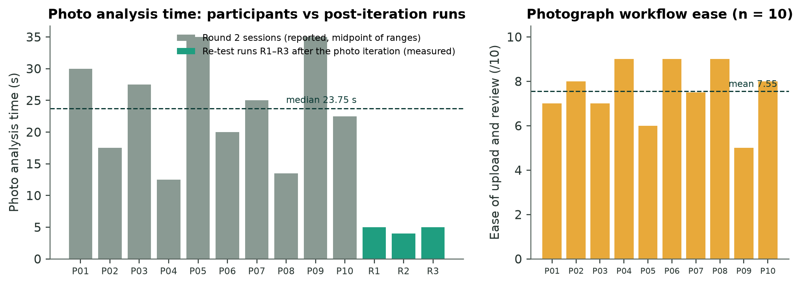

## 5.6 Receipt extraction

Round 1 and a participant's real wholesale receipt exposed four failures of the free-form prompt: missed abbreviations, olives turned into olive oil, an invented water, and lost repeat quantities. After the redesign, all 49 expected rows across four receipts were correct and all 11 non-food products were removed (Figure 27); each receipt confirmed in 5–8 s. The holdout receipt scored 8/12 on its first unchanged run, which exposed an OCR weight bug and unlisted abbreviations. I fixed both with general rules, but the holdout is no longer blind, and accuracy on other stores remains unmeasured.

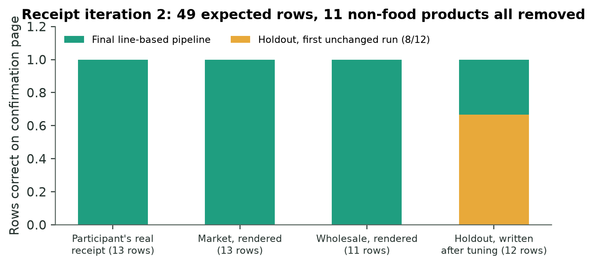

## 5.7 Text model and safety

Three model families answered 18 frozen cases covering recipes, receipts, swaps and step-aware cooking (Figure 28). Phi-3.5 failed the structure and safety gates, with only 35.7% valid output. Qwen2.5 3B scored 0.960 and Llama 3.2 3B 0.944. That difference sat inside the 0.03 practical-tie margin fixed in advance, so Llama's lower latency (1.11 s against 1.53 s) decided the choice. The raw audit mattered more than the scores: Llama advised rinsing raw chicken, and Qwen called chicken at 60 °C safe. This finding led directly to the deterministic safety answers described in Section 4.10. A small, author-built benchmark cannot measure recipe appeal, so participant ratings supplement it (Section 5.9).

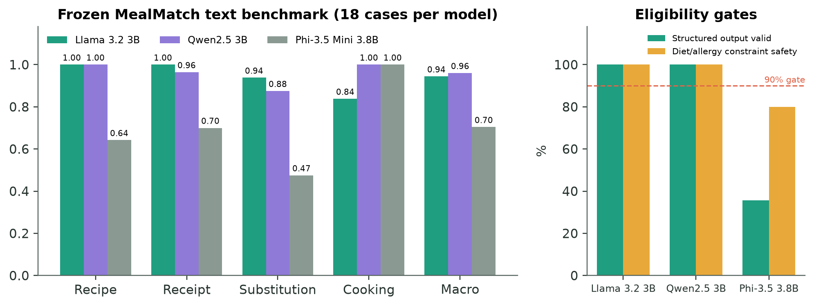

## 5.8 Speech recognition and hands-free cooking

A controlled manifest of 108 synthetic clips (18 commands, three voices, clean and 10 dB noise) first selected a Whisper size and then compared three model families (Figure 29). Only Whisper small.en passed both gates, with 98.1% clean and 92.6% noisy intent accuracy. Synthetic voices lack hesitation, accents and kitchen acoustics, so ten participants then used the integrated flow. The session tally recorded 70/70 successful core commands with no retries. The ten retained rows had a mean response time of 2.00 s and a mean rating of 4.90/5 (Figure 30), and they included natural phrasings and open questions (Figure 31).

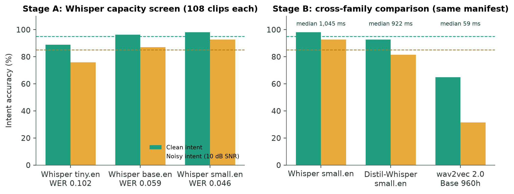

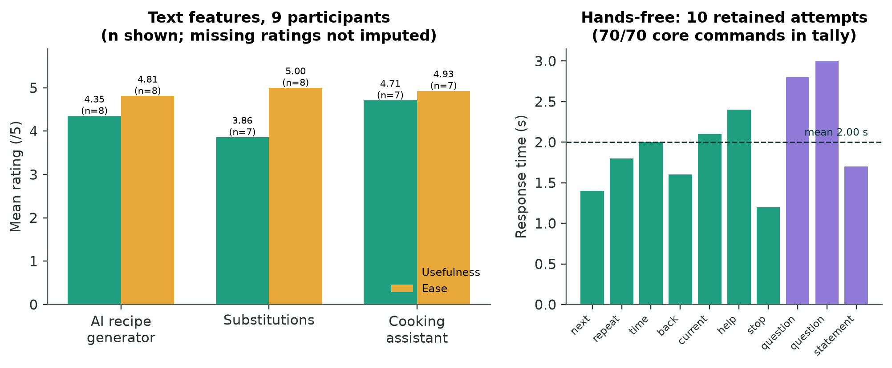

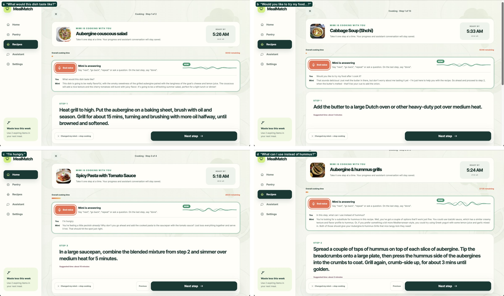

## 5.9 User studies and design iterations

Round 1 (one participant) was a pilot. It found that "Next" did not move the visible step (Figure 33b) and that correcting quantities was slow. It also found that receipt repeats collapsed into one item, and that the AI generator jumped straight to a single recipe (Figure A3a). Round 2 widened the study to ten participants (the pilot participant included and counted once), with a nine-person text-feature subset and a ten-person hands-free subset. It followed a written protocol (Appendix D), which recruited adults purposively to mix frequent and infrequent cooks, people who manage household groceries, levels of technical confidence, and phone and desktop users. Sessions of about 35–45 minutes set fourteen goal-based tasks rather than interface instructions, from first-use comprehension through photo and receipt entry, waste-aware discovery, AI recipe choice, swaps and shopping, and hands-free cooking, to session recovery and custom preferences. Short interviews followed each stage. The protocol used fictional dietary and allergy scenarios so that no health information was collected, and observers recorded results under anonymous codes, without video or persistent audio. The information sheet and observer worksheet are in Appendices C and E. Table 7 traces the main findings to design changes and re-test outcomes.

Table 7: From findings to design changes.

| Finding | Evidence | Change | Outcome |
|---|---|---|---|
| Quantity and unit editing slow | Raised by 10/10 | Steppers, typed amounts, household units | Test 2–3 ease 5/7 (SEQ) |
| Receipt abbreviations and repeats | 9/10 and 6/10 | Code parsing + per-line schema | 49/49 rows |
| "Next" answered but card stayed | 5 participants | One intent per transcript | All attempted phrases advanced |
| Wanted several recipe concepts | 7 of 10 (2 preferred one) | Three idea cards | AI recipe usefulness 4.35/5 (n = 8) |
| Generated food images artificial | 6 of 9 | Photos off, then removed; emoji art | No image wait; 5.7 GB freed |
| Incoherent AI recipes | Ice cream → tomato pie; sweet → beef | Relevance, taste and title checks | Re-test: recipes matched requests |
| Swaps sometimes missing | Usefulness 3.86/5 | Pantry → table → model swaps | Re-test: rated more useful |
| Lost place and ideas after a recipe | Feedback before iteration 3 | Screen kept mounted; ideas persist | Re-test: higher usability |
| Tour never seen again | Iteration 3 re-test | Tour on first load | Verified in browser |

Figures 32, 33 and 34 show evidence behind several of these rows. In Figure 32, Version 2 took quantities as free text and named the model beside each confidence, while Version 3 adds steppers, household units and a shorter confidence label next to the label text the model read. Figure 34(a) shows a strawberry–brie crostini offered for a pantry request, and Figure 34(b) an encoding fault that displayed "190¼a".

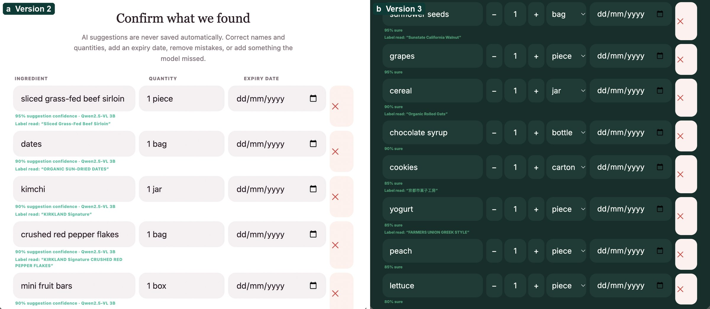

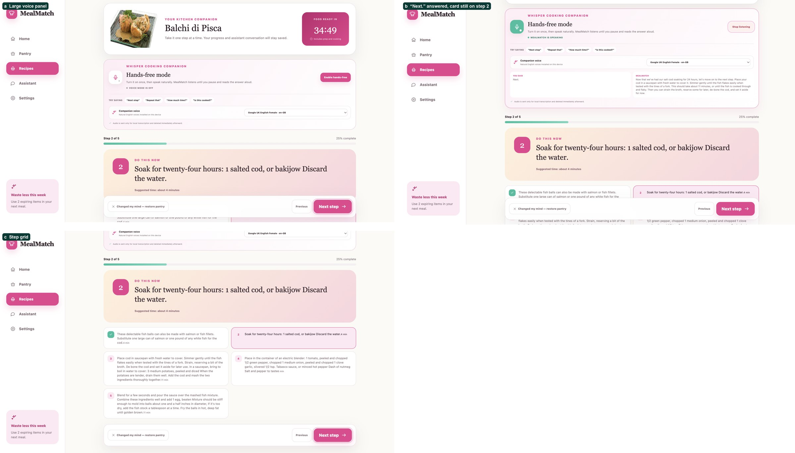

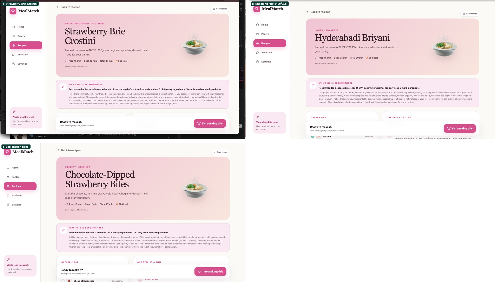

After iteration 3, the same cohort reported recipes that matched their requests and used the pantry better, more useful swaps, and higher usability. Generation also became faster (Table 8): the median time fell from 10.85 s to 5.05 s, and every trial after the iteration was faster than the fastest trial before it (7.9 s).

Table 8: AI-recipe generation time before (Test 1) and after (Test 2) iteration 3, ten timed trials each.

| Trial | Test 1: before (s) | Test 2: after (s) |
|---|---|---|
| 1 | 11.8 | 4.9 |
| 2 | 9.6 | 5.7 |
| 3 | 13.2 | 3.8 |
| 4 | 8.7 | 6.1 |
| 5 | 12.4 | 4.4 |
| 6 | 10.5 | 5.2 |
| 7 | 14.1 | 6.6 |
| 8 | 7.9 | 3.5 |
| 9 | 11.2 | 5.5 |
| 10 | 9.1 | 4.7 |
| **Median** | **10.85** | **5.05** |

## 5.10 Recommendation and expiry awareness

Unit tests confirm the intended behaviour. A recipe using spinach due tomorrow outranks a complete match that rescues nothing, expired food no longer counts as available, diet conflicts sort last, and allergy conflicts score zero. On the participant's real pantry, the top recommendations used the salmon and prawns due the next day and the beef due that day. All ten Round 2 participants described recommendations as useful or potentially valuable, although several wanted stronger taste learning. The draft proposed a Precision@5 and nDCG study against the baselines (Järvelin and Kekäläinen, 2002), but I did not build the relevance judgements it requires. The recommender's relevance is therefore supported by tests and formative feedback, not by an offline ranking metric, which is the largest evaluation gap in the project.

## 5.11 Performance and resources

Table 9 and Figure 35 summarise the costs of running locally, measured on the reference Apple M4 Pro.

Table 9: Measured latency.

| Operation | Measurement |
|---|---|
| Photo, first results | 4–5 s (controlled); 6.5–9.5 s medians (participants' photos, 5 runs each) |
| Receipt to review list | 5–8 s |
| Text model, benchmark median | 1.11 s |
| Whisper transcription (Stage B median) | 1.05 s |
| Three AI recipe ideas (one live run) | about 16 s |
| Generated recipe photo (removed) | about 10 s each, 5.7 GB |

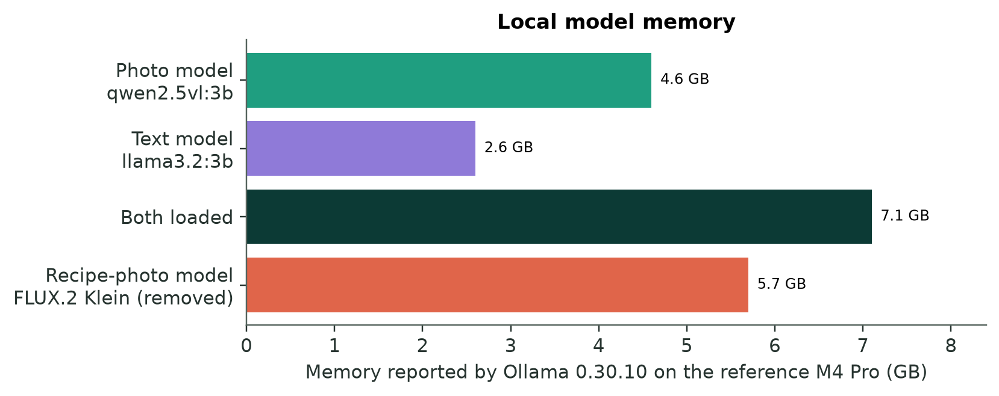

The photo and text models together need 7.1 GB, so the photo model unloads after five idle minutes. Local processing protects privacy but excludes lower-powered devices, a trade-off I return to in Chapter 6.

## 5.12 Accessibility

The audit confirmed semantic landmarks, a skip link, labelled navigation, live-region announcements, text equivalents for colour-coded status, reduced motion and non-speech alternatives. It also exposed one real defect: the dark-theme contrast of in-pantry swaps, which I fixed. No screen-reader, keyboard-only or zoom audit was completed, and no participant disability or access-needs data was collected, so the accessibility evidence remains partial. The audit itself added the skip link, a focus target for the main content, navigation labels with current-page state, and an announced status for notifications. Structural exclusions also remain: local AI needs a capable laptop, the interface and the speech benchmark are English-only, and speech accuracy has not been analysed by accent.

## 5.13 Results against objectives

Table 10: Achievement of objectives.

| Objective | Evidence | Conclusion |
|---|---|---|
| O1 Entry effort | Three routes; photo time 23.75 s → ~5 s; receipts 49/49 rows; photo corrections still 73–87% | Partially achieved |
| O2 Reliable pantry | No write without confirmation; valued by 10/10; corrections logged | Achieved |
| O3 Waste reduction | Use-soon-first ranking tested; impact panel; no field study | Partially achieved |
| O4 Useful recipes | Hard filters; recommendations useful to 10/10; AI usefulness 4.35/5; relevance fixed in iteration 3 | Achieved (formative) |
| O5 Understandable | Match %, missing items, use-soon and diet labels; not rated separately | Partially achieved |
| O6 Cooking support | 70/70 commands; assistant usefulness 4.71/5 (n = 7); sync fixed | Achieved (formative) |

## 5.14 Critical analysis

The project succeeded most where AI output met deterministic structure. Receipts improved when code took over counting and line finding. Photos improved when code salvaged cut-off answers. Recipes became coherent when taste and title checks rejected wrong ones, and voice became reliable when each transcript mapped to exactly one action. The largest failure was trusting a benchmark: the fine-tuned detector was the right answer to the question I measured and the wrong answer for real kitchens. Evaluating in the target domain before deployment would have saved that detour.

The evidence has clear limits. The user studies are small, formative and partly re-tests of the same cohort. Several measures were not retained, including per-attempt voice logs, re-test counts, post-iteration swap ratings and SUS, and some early interview questions were leading. The audio benchmark is synthetic, the receipt rules were tuned on their test receipts, and the frozen photo test is no longer blind. All timings come from one laptop, sometimes on low battery. Allergy logic has not been clinically validated, and generated recipes still require ordinary food-safety judgement.

Validity is also limited by my dual role. I designed the system, wrote the tasks, moderated the sessions and analysed the results, which risks confirmation bias; the frozen gates reduce this risk for the model choices but not for the interviews. Re-tests with the same cohort mix improvement with learning and familiarity, and a short session cannot show whether novelty would fade at home.

[[PLACEHOLDER: Ethics approval reference and consent procedure for the participant studies.]]

# Chapter 6: Conclusion

## 6.1 Summary

I set out to test whether several specialised AI models, coordinated by deterministic code and supervised by the user, could turn a household's food into timely meal decisions. MealMatch achieves the complete loop, from photo, receipt or typed entry and confirmation to expiry-first ranking, guarded recipe ideas and hands-free cooking that updates the pantry.

The route there was not linear. I replaced EasyOCR after it crashed the server and replaced a benchmark-winning detector after it failed in real kitchens. I switched image generation off and then removed it, and I rewrote the receipt, photo, recipe and swap pipelines after users exposed their failures. Each change is recorded in a decision log of 47 entries (Appendix B), which became the backbone of this report.

## 6.2 Answer to the research question

The answer is *substantially, provided the user remains in control*. AI acquisition reduces effort: receipts produce complete, correct rows in seconds, and photo analysis fell from about 24 s to about 5 s. Photo recall on crowded scenes remains too low to trust without review, so human confirmation is justified, and all ten participants valued it. The recommendations were relevant and personalised within formative testing. Transparency came from visible reasons (match, missing items, use-soon food and diet conflicts) rather than from a model's explanation.

## 6.3 Broader themes

Three lessons extend beyond this project. First, benchmark rank is not deployment fitness. The detector and the 7B vision model both led on public data and failed operational gates at home. Second, orchestration means code as much as models. The most effective changes (per-line schemas, answer salvage, taste checks and one-intent voice routing) constrained models rather than replacing them. Third, local AI trades capability and hardware reach for privacy and cost. That trade-off shaped every model choice, and it removed image generation entirely. A fourth lesson concerns evaluation itself. Fixing gates before testing stopped me from choosing thresholds after seeing results. The same discipline would have helped the user studies, where several useful measures were not retained. Finally, privacy and inclusion pulled in different directions. Keeping every model local protects household data, yet it demands the hardware that the households most exposed to food costs may not own.

## 6.4 Contribution and originality

MealMatch's originality lies in integration and in its evidence trail: a verified pantry that feeds expiry-first ranking, guarded generation with deterministic safety rules, and model decisions made under frozen rules, with failures and reversals documented rather than hidden. The project contributes three things that others could reuse. The first is a working orchestration of five model families behind replaceable services, all running on one laptop. The second is a two-stage evaluation method that tests each model on a frozen public benchmark and again in the target setting, with gates fixed in advance. The third is a set of small deterministic components that make weak local models usable: the per-line receipt schema, the salvage of cut-off answers, the one-intent voice router and the head-food ingredient analysis.

## 6.5 Future work

The next steps are a longitudinal diary study to measure real food waste, and an offline relevance benchmark for the recommender. Voice sessions should be fully logged per attempt, and a complete accessibility audit carried out. A hosted 7B vision mode could be tested once its timeouts are solved, and barcode entry could handle packaged goods. The recommender could also learn each user's taste from ratings and cooked meals, the personal learning that Section 2.2 found missing, while keeping unfamiliar recipes in every list. Accounts would allow multi-user deployment. Participants also asked for features that the scope excluded: expiry notifications and a workflow for leftovers (P07), and stronger learning of personal taste. The evidence gaps in Chapter 5 define the next study. It should record swap ratings per participant, log every voice attempt with its transcript, intent and card state, and recruit people who use assistive technology or speak with varied accents. Participants should be paid and involved in setting priorities, not only in validating a nearly finished interface. The central lesson would guide all of these: AI adds most value when specialised models reduce effort, structured code constrains their output, and people keep authority over decisions that matter.

Personally, the project taught me to read user reports as evidence about the whole pipeline rather than about the model alone. When a refrigerator photograph lost many of its items, the model was only part of the cause: the app was discarding every answer that had been cut off. When a sweet request produced beef, the cause was one word in a list of filler words. Tracing failures end to end, from request to screen, was the most transferable skill I gained.

# References

Abdin, M. et al. (2024) 'Phi-3 Technical Report: A Highly Capable Language Model Locally on Your Phone', *arXiv preprint* arXiv:2404.14219.

Amershi, S., Weld, D., Vorvoreanu, M., Fourney, A., Nushi, B., Collisson, P., Suh, J., Iqbal, S., Bennett, P.N., Inkpen, K., Teevan, J., Kikin-Gil, R. and Horvitz, E. (2019) 'Guidelines for Human-AI Interaction', *Proceedings of the 2019 CHI Conference on Human Factors in Computing Systems*, pp. 1–13. doi: 10.1145/3290605.3300233.

Baevski, A., Zhou, H., Mohamed, A. and Auli, M. (2020) 'wav2vec 2.0: A Framework for Self-Supervised Learning of Speech Representations', *Advances in Neural Information Processing Systems*, 33, pp. 12449–12460.

Bai, S. et al. (2025) 'Qwen2.5-VL Technical Report', *arXiv preprint* arXiv:2502.13923.

Benita, J., Teja, A.N.S., Reddy, B.V.S., Raghava, Ch.M. and Subrahmanyam, M.D.S. (2026) 'A Web Platform for Recipe Scaling and Per-Serving Ingredient Delivery with AI-Powered Cooking Assistance', *2026 IEEE International Conference on Emerging Computing and Intelligent Technologies (ICoECIT)*. doi: 10.1109/ICoECIT68303.2026.11497495.

Bossard, L., Guillaumin, M. and Van Gool, L. (2014) 'Food-101 – Mining Discriminative Components with Random Forests', in *Computer Vision – ECCV 2014*. Cham: Springer, pp. 446–461. doi: 10.1007/978-3-319-10599-4_29.

Budhiraja, S., Batra, N., Rani, S., Dixit, R., Garg, A. and Tyagi, P. (2025) 'AI-Driven Indian Cuisine Recommender for Health-Conscious Foodies', *2025 International Conference on Artificial Intelligence and Machine Vision (AIMV)*, pp. 1–6. doi: 10.1109/AIMV66517.2025.11203599.

Cal AI (2026) *Cal AI: AI-Powered Calorie Tracking*. Available at: https://www.calai.app/ (Accessed: 19 August 2026).

Centers for Disease Control and Prevention (2024) *Chicken and Food Poisoning*. Available at: https://www.cdc.gov/food-safety/foods/chicken.html (Accessed: 24 September 2026).

Cheng, T., Song, L., Ge, Y., Liu, W., Wang, X. and Shan, Y. (2024) 'YOLO-World: Real-Time Open-Vocabulary Object Detection', *Proceedings of the IEEE/CVF Conference on Computer Vision and Pattern Recognition (CVPR)*, pp. 16901–16911.

Dubey, A. et al. (2024) 'The Llama 3 Herd of Models', *arXiv preprint* arXiv:2407.21783.

Efron, B. and Tibshirani, R.J. (1993) *An Introduction to the Bootstrap*. New York: Chapman & Hall.

FoodSafety.gov (n.d.) *Safe Minimum Internal Temperatures*. Available at: https://www.foodsafety.gov/food-safety-charts/safe-minimum-internal-temperatures (Accessed: 24 September 2026).

Freyne, J. and Berkovsky, S. (2010) 'Intelligent Food Planning: Personalized Recipe Recommendation', *Proceedings of the 15th International Conference on Intelligent User Interfaces (IUI '10)*, pp. 321–324. doi: 10.1145/1719970.1720021.

Gandhi, S., von Platen, P. and Rush, A.M. (2023) 'Distil-Whisper: Robust Knowledge Distillation via Large-Scale Pseudo Labelling', *arXiv preprint* arXiv:2311.00430.

Ilyas, S., Shah, A.A. and Sohail, A. (2021) 'Order Management System for Time and Quantity Saving of Recipes Ingredients Using GPS Tracking Systems', *IEEE Access*, 9, pp. 100490–100497. doi: 10.1109/ACCESS.2021.3090808.

Järvelin, K. and Kekäläinen, J. (2002) 'Cumulated Gain-Based Evaluation of IR Techniques', *ACM Transactions on Information Systems*, 20(4), pp. 422–446. doi: 10.1145/582415.582418.

Ji, Z., Lee, N., Frieske, R., Yu, T., Su, D., Xu, Y., Ishii, E., Bang, Y.J., Madotto, A. and Fung, P. (2023) 'Survey of Hallucination in Natural Language Generation', *ACM Computing Surveys*, 55(12), Article 248. doi: 10.1145/3571730.

Jiao, Y. (2024) 'Managing Decision Fatigue: Evidence from Analysts' Earnings Forecasts', *Journal of Accounting and Economics*, 77(1), Article 101615. doi: 10.1016/j.jacceco.2023.101615.

Johnson, J., Douze, M. and Jégou, H. (2019) 'Billion-Scale Similarity Search with GPUs', *IEEE Transactions on Big Data*, 7(3), pp. 535–547. doi: 10.1109/TBDATA.2019.2921572.

Kuo, W., Cui, Y., Gu, X., Piergiovanni, A.J. and Angelova, A. (2023) 'Open-Vocabulary Object Detection upon Frozen Vision and Language Models', *International Conference on Learning Representations (ICLR 2023)*.

Kuznetsova, A. et al. (2020) 'The Open Images Dataset V4: Unified Image Classification, Object Detection, and Visual Relationship Detection at Scale', *International Journal of Computer Vision*, 128(7), pp. 1956–1981. doi: 10.1007/s11263-020-01316-z.

Liu, S., Zeng, Z., Ren, T., Li, F., Zhang, H., Yang, J., Jiang, Q., Li, C., Yang, J., Su, H., Zhu, J. and Zhang, L. (2024) 'Grounding DINO: Marrying DINO with Grounded Pre-Training for Open-Set Object Detection', in *Computer Vision – ECCV 2024*. Cham: Springer.

Malhan, C., Kumar, R. and Rani, N. (2025) 'An Artificial Intelligence Enabled Approach to Plan and Find Recipe', *2025 International Conference on Innovations and Emerging Technologies in AI & Communication Systems (IETACS)*. doi: 10.1109/IETACS68750.2025.11385665.

Marin, J., Biswas, A., Ofli, F., Hynes, N., Salvador, A., Aytar, Y., Weber, I. and Torralba, A. (2021) 'Recipe1M+: A Dataset for Learning Cross-Modal Embeddings for Cooking Recipes and Food Images', *IEEE Transactions on Pattern Analysis and Machine Intelligence*, 43(1), pp. 187–203. doi: 10.1109/TPAMI.2019.2927476.

Mob (2026) 'Discover and Search for Recipes', *Mob Help Centre*. Available at: https://support.mob.co.uk/en/articles/16412092-discover-and-search-for-recipes (Accessed: 19 August 2026).

MyFitnessPal (2025) 'Voice Logging', *MyFitnessPal Support*. Available at: https://support.myfitnesspal.com/hc/en-us/articles/30332897072269-Voice-Logging (Accessed: 19 August 2026).

MyFitnessPal (2026a) 'Meal Scan FAQ', *MyFitnessPal Support*. Available at: https://support.myfitnesspal.com/hc/en-us/articles/360045761612-Meal-Scan-FAQ (Accessed: 19 August 2026).

MyFitnessPal (2026b) 'Meal Planner', *MyFitnessPal Support*. Available at: https://support.myfitnesspal.com/hc/en-us/articles/34347103172877-Meal-Planner (Accessed: 19 August 2026).

National Environment Agency (2026) *Food Waste Management*. Singapore: National Environment Agency. Available at: https://www.nea.gov.sg/our-services/waste-management/3r-programmes-and-resources/food-waste-management (Accessed: 19 August 2026).

Nielsen, J. and Landauer, T.K. (1993) 'A Mathematical Model of the Finding of Usability Problems', *Proceedings of the INTERACT '93 and CHI '93 Conference on Human Factors in Computing Systems*, pp. 206–213. doi: 10.1145/169059.169166.

Ollama (2026) *Ollama Documentation*. Available at: https://docs.ollama.com/ (Accessed: 19 August 2026).

Parasuraman, R. and Riley, V. (1997) 'Humans and Automation: Use, Misuse, Disuse, Abuse', *Human Factors*, 39(2), pp. 230–253. doi: 10.1518/001872097778543886.

Radford, A., Kim, J.W., Xu, T., Brockman, G., McLeavey, C. and Sutskever, I. (2023) 'Robust Speech Recognition via Large-Scale Weak Supervision', *Proceedings of the 40th International Conference on Machine Learning*, PMLR 202, pp. 28492–28518.

Reimers, N. and Gurevych, I. (2019) 'Sentence-BERT: Sentence Embeddings Using Siamese BERT-Networks', *Proceedings of EMNLP-IJCNLP 2019*, pp. 3982–3992. doi: 10.18653/v1/D19-1410.

Rokon, M.S.J., Morol, M.K., Hasan, I.B., Saif, A.M., Khan, R.H. and Das, S.S. (2022) 'Food Recipe Recommendation Based on Ingredients Detection Using Deep Learning', *Proceedings of the 2nd International Conference on Computing Advancements (ICCA 2022)*, pp. 191–198. doi: 10.1145/3542954.3542983.

Salvador, A., Drozdzal, M., Giró-i-Nieto, X. and Romero, A. (2019) 'Inverse Cooking: Recipe Generation from Food Images', *Proceedings of the IEEE/CVF Conference on Computer Vision and Pattern Recognition (CVPR)*, pp. 10453–10462. doi: 10.1109/CVPR.2019.01070.

Samad, S., Ahmed, F., Naher, S., Kabir, M.A., Das, A., Amin, S. and Islam, S.M.S. (2022) 'Smartphone Apps for Tracking Food Consumption and Recommendations: Evaluating Artificial Intelligence-Based Functionalities, Features and Quality of Current Apps', *Intelligent Systems with Applications*, 15, Article 200103. doi: 10.1016/j.iswa.2022.200103.

Singh, S.P., Siddharth, D., Prabakeran, S., Das, R. and Balaji, A. (2024) 'Food-Lens: Improving Culinary Experiences with AI-Driven Meal Analysis and Recipe Generation', *2024 2nd International Conference on Sustainable Computing and Smart Systems (ICSCSS)*, pp. 1385–1391. doi: 10.1109/ICSCSS60660.2024.10625000.

Smith, R. (2007) 'An Overview of the Tesseract OCR Engine', *Proceedings of the Ninth International Conference on Document Analysis and Recognition (ICDAR 2007)*, vol. 2, pp. 629–633. doi: 10.1109/ICDAR.2007.56.

SuperCook (n.d.) *SuperCook: Zero Waste Recipe Generator*. Available at: https://www.supercook.com/ (Accessed: 19 August 2026).

TheMealDB (n.d.) *TheMealDB: An Open, Crowd-Sourced Database of Recipes*. Available at: https://www.themealdb.com/ (Accessed: 10 September 2026).

Tintarev, N. and Masthoff, J. (2007) 'A Survey of Explanations in Recommender Systems', in *2007 IEEE 23rd International Conference on Data Engineering Workshop*. Istanbul: IEEE, pp. 801–810. doi: 10.1109/ICDEW.2007.4401070.

Trattner, C. and Elsweiler, D. (2017) 'Food Recommender Systems: Important Contributions, Challenges and Future Research Directions', *arXiv preprint* arXiv:1711.02760.

van Herpen, E. and de Hooge, I.E. (2016) 'Love Food, Hate the Brand That I Waste: The Effects of Product Waste on Brand Evaluations', paper presented at the *47th Annual Association for Consumer Research Conference*, Berlin, 27–30 October.

Vir, R. and Madinei, P. (2024) 'ARChef: An iOS-Based Augmented Reality Cooking Assistant Powered by Multimodal Gemini LLM', *arXiv preprint* arXiv:2412.00627.

W3C (2023) *Web Content Accessibility Guidelines (WCAG) 2.2*. W3C Recommendation, 5 October 2023. Available at: https://www.w3.org/TR/WCAG22/ (Accessed: 28 September 2026).

Wang, W., Wei, F., Dong, L., Bao, H., Yang, N. and Zhou, M. (2020) 'MiniLM: Deep Self-Attention Distillation for Task-Agnostic Compression of Pre-Trained Transformers', *Advances in Neural Information Processing Systems*, 33, pp. 5776–5788.

Yamamoto, S. and Mori, H. (eds.) (2021) *Human Interface and the Management of Information: Information Presentation and Visualization (HIMI 2021)*. Lecture Notes in Computer Science, vol. 12765. Cham: Springer. doi: 10.1007/978-3-030-78321-1.

Yang, A. et al. (2024) 'Qwen2.5 Technical Report', *arXiv preprint* arXiv:2412.15115.

Zhao, Y., Lv, W., Xu, S., Wei, J., Wang, G., Dang, Q., Liu, Y. and Chen, J. (2024) 'DETRs Beat YOLOs on Real-Time Object Detection', *Proceedings of the IEEE/CVF Conference on Computer Vision and Pattern Recognition (CVPR)*, pp. 16965–16974.

# Appendix A: Additional figures

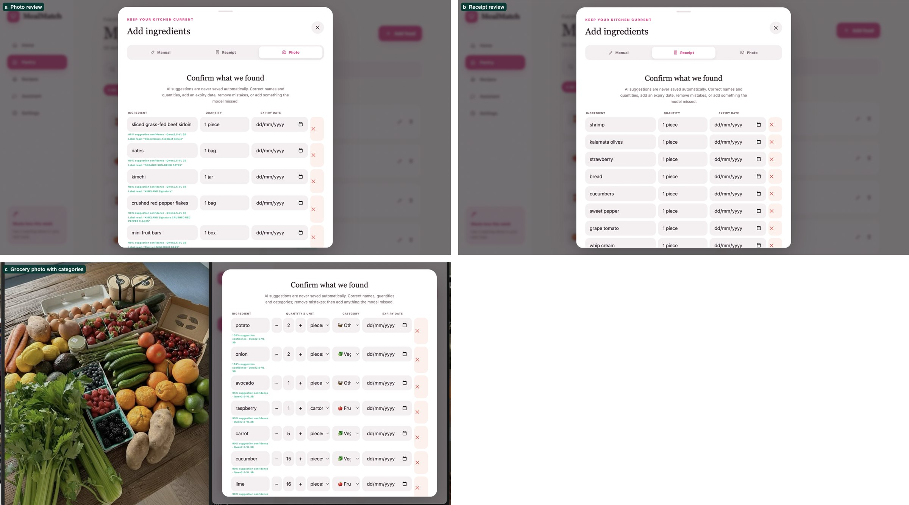

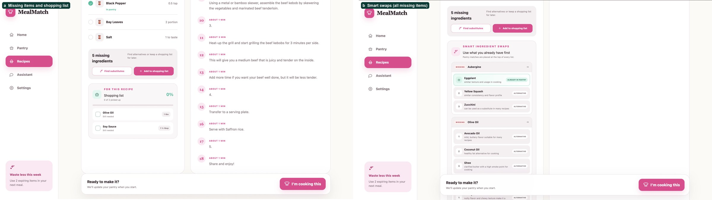

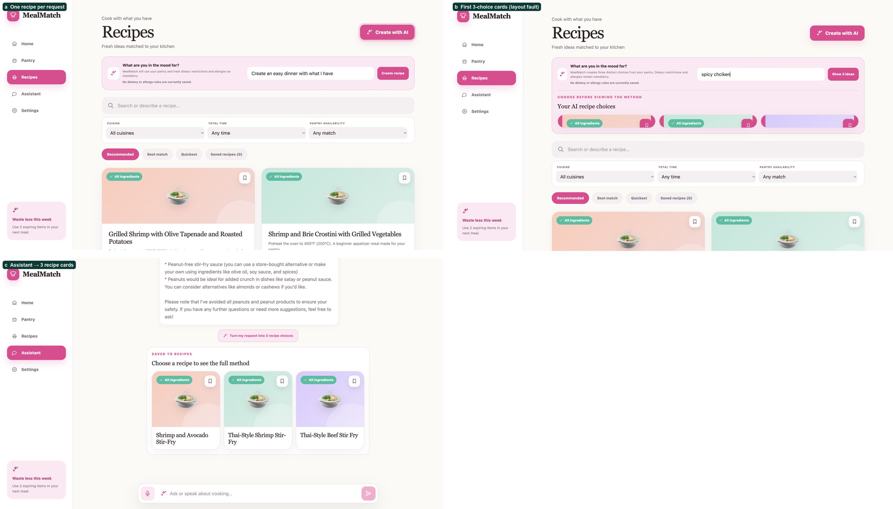

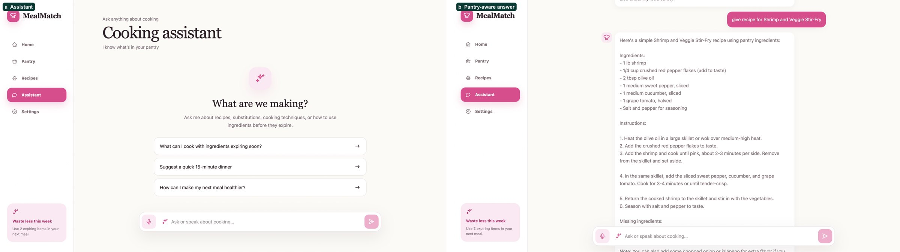

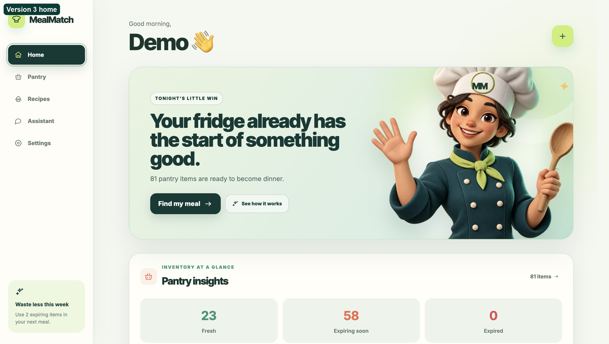


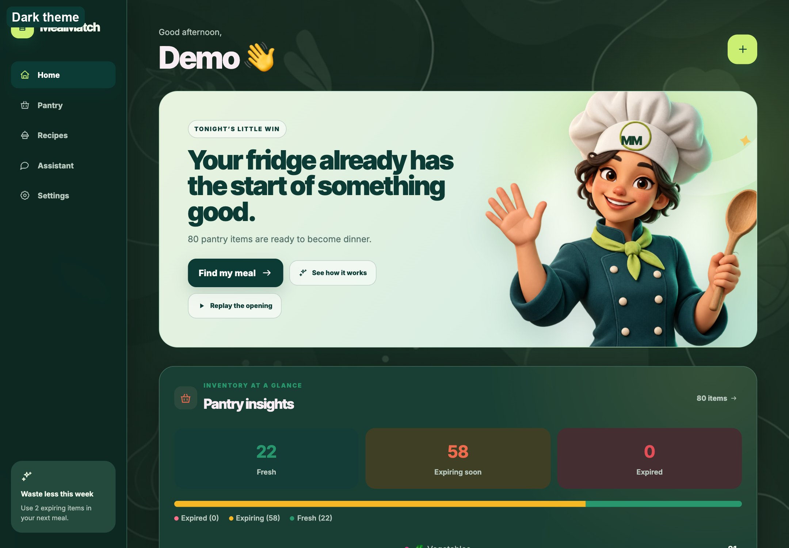

# Appendix B: Decision log index

The full log, with the evidence and alternatives for each decision, is `docs/decision-log.md` in the repository. All dates are in 2026.

Table B1: Decisions 1 to 16.

| No. | Date | Decision |
|---|---|---|
| 1 | 29 June | Use SQLite for the MVP database |
| 2 | 29 June | Use FastAPI for the backend |
| 3 | 29 June | Separate AI prediction from database storage using human-in-the-loop verification |
| 4 | 29 June | Use mocked image ingredient detection before integrating real OCR/vision models |
| 5 | 29 June | Use hybrid retrieval instead of embedding-only recipe retrieval |
| 6 | 29 June | Use a custom ranking formula for recommendation ordering |
| 7 | 29 June | Use Ollama for local LLM explanations |
| 8 | 29 June | Use seed recipes during development before importing a larger recipe dataset |
| 9 | Undated (prototype) | Add EasyOCR for receipt-based ingredient extraction |
| 10 | Undated (prototype) | Replace EasyOCR backend integration with Tesseract CLI for the MVP |
| 11 | 9 September | Restructure the prototype as a responsive multi-screen application |
| 12 | 9 September | Deduct pantry quantities when a user starts a recipe |
| 13 | 9 September | Make semantic recommendation loading optional at API startup |
| 14 | 10 September | Rank recipes with pantry, expiry, cuisine, and safety signals |
| 15 | 10 September | Use layered receipt filtering and keep human verification |
| 16 | 10 September | Make cooking a persistent, reversible session |

Table B2: Decisions 17 to 32.

| No. | Date | Decision |
|---|---|---|
| 17 | 10 September | Combine a real recipe source with optional local AI generation |
| 18 | 10 September | Add durable saved recipes and custom preferences |
| 19 | 12 September | Use three pre-trained models across text, image, and audio |
| 20 | 12 September | Make dietary rules hard filters and rank pantry coverage first |
| 21 | 12 September | Separate general assistant context from active cooking context |
| 22 | 12 September | Persist missing ingredients as a shopping list |
| 23 | 12 September | Store or estimate per-step cooking durations |
| 24 | 18 September | Make hands-free cooking the primary Whisper workflow |
| 25 | 19 September | Evaluate open-vocabulary detectors and use a local VLM as a packaged-food fallback |
| 26 | 20 September | Deploy the fine-tuned YOLO-World food checkpoint |
| 27 | 21 September | Reject YOLO for household deployment and evaluate Qwen variants |
| 28 | 23 September | Select Qwen2.5-VL 3B for household photo extraction |
| 29 | 24 September | Retain 3B after the public external-validity check |
| 30 | 24 September | Select Whisper small.en for hands-free cooking |
| 31 | 24 September | Retain Llama 3.2 3B behind deterministic food-safety guards |
| 32 | 24 September | Confirm Whisper small.en in a cross-family ASR comparison |

Table B3: Decisions 33 to 47.

| No. | Date | Decision |
|---|---|---|
| 33 | 24 September | Confirm Llama 3.2 3B in a three-family text comparison |
| 34 | 27 September | Parse receipt lines in code and let the model only name them |
| 35 | 27 September | Recover cut-off photo answers and test close-up passes |
| 36 | 28 September | Close-ups on request, shorter model hold and pinned model versions |
| 37 | 28 September | Coherent, unique AI recipe ideas with title cards instead of generated photos |
| 38 | 28 September | Diet rules as hard filters with a labelled fallback, and use-soon food first |
| 39 | 28 September | One action per voice command, finishing by voice, and a reliable wake word |
| 40 | 28 September | Update the pantry when the meal is ready, with unit conversion |
| 41 | 28 September | The fridge film is the landing page |
| 42 | 28 September | Taste words decide sweet or savoury, and a sweet request starts from sweet pantry food |
| 43 | 28 September | Remove recipe-photo generation; emojis stand in |
| 44 | 28 September | Keep the screen under a recipe, and AI ideas until cleared |
| 45 | 28 September | Swaps from the pantry and a kitchen table first, the model last |
| 46 | 28 September | The cooking and loading screens follow the app palette |
| 47 | 28 September | The product tour plays when the app first loads |

# Appendix C: Participant information sheet

The information sheet for the Round 2 sessions (version 1, 20 September 2026). Drafting notes have been removed, and the wording has been aligned with the sessions as they were run (Section 5.9).

### Study details

- **Study title:** Evaluating MealMatch, an AI-assisted pantry and cooking application.
- **Student researcher:** Jafrin Rose, BSc Computer Science Final Year Project, SIM Global Education, Goldsmiths, University of London.
- **Researcher email:** jamalm001@mymail.sim.edu.sg

### Invitation

You are invited to take part in a research study evaluating MealMatch, an AI-assisted application for keeping track of household food, finding recipes and receiving hands-free guidance while cooking. Before deciding, please read this information carefully, and ask the researcher about anything that is unclear.

### What is the purpose of the study?

This study is part of an undergraduate BSc Computer Science final year project. It investigates whether people can use MealMatch successfully, whether its AI suggestions are understandable and useful, and whether its text, image and speech features work together effectively. The study evaluates a prototype; it does not provide medical, nutritional or food-safety advice.

### Why have I been invited?

You have been invited because you are aged 18 or over and can use an English-language web application. About 8 to 12 adults will take part, with different levels of cooking experience and technical confidence. You do not need specialist knowledge or an actual dietary restriction or allergy: dietary and allergy features are tested with fictional scenarios supplied by the researcher.

### Do I have to take part?

No. Participation is entirely voluntary. Choosing not to take part, refusing to answer a question or stopping a task will have no effect on your studies, employment, services or relationship with the researcher, SIM Global Education or Goldsmiths. You may take a break or end the session at any time without giving a reason.

### Can I withdraw my data?

You may ask to withdraw your identifiable study data until 25 September 2026 by emailing the researcher with your participant code. After that date, results will have been anonymised and combined across participants, so it may no longer be possible to identify and remove an individual contribution.

### What will happen if I take part?

The session takes about 35 to 45 minutes. You will be asked to:

- add pantry items from a food photograph and a receipt, and correct them;
- find or request recipes using a fictional pantry and preferences;
- assess an AI-generated recipe and a substitution;
- use hands-free commands, such as moving to the next cooking step, repeating an instruction and checking the remaining time;
- rate how easy, trustworthy and useful the features were; and
- answer short questions about the interface and the AI outputs.

The researcher will observe the session and complete a structured worksheet. No video or screen recording will be made. When you use a voice feature, the browser briefly captures the command and sends it to the MealMatch server running on the researcher's computer for transcription. The audio file is deleted immediately after transcription and is not kept as research data. The text transcript, the predicted command, the response time and whether the correct action appeared on screen are recorded under an anonymous participant code.

Please do not enter names, contact information, medical details, photographs of people or other confidential information into MealMatch during the session.

### What information will be collected and why?

The study collects only the information needed to evaluate the prototype:

- an anonymous code such as P01;
- task completion, time, errors, retries and corrections;
- the model inputs and outputs produced during the tasks;
- speech transcripts, predicted command intents and on-screen outcomes, but not the voice recordings;
- ratings on 1 to 5, 1 to 7 or 1 to 10 scales of ease, confidence, trust and usefulness;
- questionnaire answers and the researcher's observation notes; and
- anonymous quotations from your comments, only if you agree.

Your name, signature and contact details appear only on the consent form or in study correspondence. They are stored separately from the research data and are never connected to your answers in the report. The study does not ask for ethnicity, religion, health information, actual allergies or any other special-category data.

### What are the possible disadvantages or risks?

This is a low-risk usability study. You may feel mild frustration or fatigue when the prototype is slow or wrong, and AI-generated content may be incomplete or inaccurate. You will not be asked to prepare or eat food, follow safety-critical instructions or reveal private information. You may skip any task, take a break or stop the session.

### Are there benefits?

There is no guaranteed personal benefit, and there is no payment for taking part. Your feedback may improve MealMatch and add to understanding of how several pretrained AI models can be combined in a household food application.

### How will confidentiality and privacy be protected?

Signed consent forms and contact details are kept separately from the study observations. The coded data are stored in an encrypted, password-protected folder that only the student researcher can open, apart from the supervisor or examiners where assessment requires it. Only anonymised results appear in the final report, presentation or demonstration.

Identifiable participant data will not be placed in the MealMatch source-code repository, on GitHub, in public cloud storage or in a public research repository, and no identifiable data will be transferred from Singapore to the United Kingdom. Consent forms and coded working data will be securely deleted; fully anonymised results in the assessed report may be kept as part of the academic record.

Confidentiality is respected subject to legal constraints and professional guidelines. If information indicates a serious risk of harm or a legal safeguarding duty, the researcher may need to inform the supervisor or the appropriate authority.

### What will happen to the results?

Anonymised results are analysed with descriptive statistics, such as task success counts, medians and ranges, together with themes from participants' comments. They are used in the final project report and may be shown in an assessed presentation or demonstration. The small, purposive sample is not presented as representative of the general population.

### Who is organising and approving the study?

The research is part of the BSc Computer Science programme awarded by Goldsmiths, University of London, and delivered with SIM Global Education. The project has no external funding.

[[PLACEHOLDER: Ethics review process and approval reference.]]

### Who can I contact?

For questions, withdrawal requests or concerns, contact the student researcher, Jafrin Rose, at jamalm001@mymail.sim.edu.sg. If a concern is not resolved, you may contact the Chair of the Goldsmiths Research Ethics and Integrity Sub-Committee through Research Services (reisc@gold.ac.uk) or the Goldsmiths Data Protection Officer (dp@gold.ac.uk). You may also contact Singapore's Personal Data Protection Commission, or the UK Information Commissioner's Office where applicable.

Thank you for considering whether to take part.

# Appendix D: Round 2 usability test protocol

The protocol followed in Round 2, edited to match the sessions as they were run. Where the plan and the sessions differed, the difference is stated.

### D.1 Aim

Round 2 tested whether the changes made after Round 1 reduced correction effort, improved trust and kept state consistent across the pantry, recipe, assistant and cooking workflows. It also produced evidence to compare with the image, text and audio model evaluations.

### D.2 Participants

Ten adults completed Round 2; the planned range was 8 to 12. They were recruited purposively to include:

- people who cook often and people who cook rarely;
- people who regularly manage household groceries;
- different levels of technical confidence; and
- both phone and desktop users.

Dietary and allergy features used fictional scenarios, so participants never disclosed health, religious or dietary information. Only adult status was confirmed. The observer recorded the device, cooking frequency, grocery responsibility, technical confidence and prior use of recipe or pantry apps, but no names. The sample is purposive and is not statistically representative.

### D.3 Test materials

- A controlled photograph of eight known foods (Test 1).
- A refrigerator photograph and a grocery-table photograph with 15 recorded foods each (Tests 2 and 3).
- A receipt with food, a non-food item, an abbreviation such as ARTISAN BGT, and a repeated food line.
- A ground-truth sheet listing the visible foods and quantities in each photograph and receipt.
- A pantry containing at least two foods close to expiry.
- One recipe with several steps for the voice tasks.
- The observer worksheet (Appendix E), completed under an anonymous participant code.

No video, screen or lasting voice recordings were made. MealMatch processed microphone audio on the researcher's computer and deleted each recording immediately; only the transcript, intent, timing and on-screen outcome were recorded.

### D.4 Tasks

Tasks were given as goals, not as interface instructions.

1. **First use:** open MealMatch and explain what you think it helps you do.
2. **Photo entry:** add the food in the photograph, and review the suggestions until the pantry matches it.
3. **Quantity correction:** change one item from one piece to three, and set its unit to carton or box.
4. **Missed and wrong items:** remove one false suggestion, add one missed food and correct a category.
5. **Receipt entry:** upload the receipt and make the saved pantry match it, including the abbreviated and repeated items.
6. **Waste-aware discovery:** find a recipe that uses an ingredient close to expiry, and explain why it was recommended.
7. **Recipe filtering:** find a recipe that matches a stated cuisine, time limit and pantry requirement.
8. **AI recipe choices:** request a meal for a stated craving, compare the options and open one.
9. **Swaps and shopping:** find a pantry swap for one missing ingredient, and add another missing ingredient to the shopping list.
10. **Hands-free cooking:** start cooking and, without touching the screen, say "Next", "Repeat that", "How much time is left?" and one question about the step. After every command, check that the visible step matches the spoken reply.
11. **Session recovery:** leave cooking mode and return, confirm that the timer, step and recipe remain, then cancel and check that the pantry amounts are restored.
12. **Assistant to recipe:** ask the assistant for a recipe, turn the request into recipe cards and open one full method.
13. **Conversation persistence:** navigate away or reload, return to the assistant, find the earlier conversation, then clear it.
14. **Custom preferences:** add a custom dietary preference, then return Home using the MealMatch logo.

### D.5 Measures

For every task the observer recorded completion (success, partial or failure), time, errors, facilitator prompts, navigation reversals, and the Single Ease Question (SEQ, 1 = very difficult, 7 = very easy).

- **Photo and receipt entry:** true positives, false positives and false negatives against the ground truth; precision, recall and F1; exact quantity accuracy; renamed, deleted, added, re-categorised and quantity-edited items; model time and total confirmation time, recorded separately; and confidence in the final pantry (1 to 5).
- **Receipts:** non-food exclusion, abbreviation handling and repeated-line quantities.
- **Hands-free cooking:** for each command, whether the transcript, the intent and the visible step were correct, and the response time. A correct spoken answer counted as a failure if the visible step did not change.
- **Overall experience:** the protocol planned the 10-item System Usability Scale after all tasks. It was not administered (Table 6), and some other measures were not retained (Section 5.14).

The success criteria, set before testing, are those in Table 6.

### D.6 Interview questions

The same core questions were asked in the same order. Open questions came first and ratings afterwards, and neutral follow-ups such as "Can you tell me more about that?" were used.

**Before the tasks**

- Before today, how, if at all, did you keep track of the food you have at home?
- Tell me about any recent occasion, if any, when food at home spoiled before it was used.
- How do you usually decide what to cook, and what information do you consider when choosing a recipe?

**After photo entry**

- Please describe what happened after you chose the photograph.
- How did you approach checking and editing the returned ingredients? Which parts, if any, were easy or difficult?
- How confident were you that the final list matched the photograph, and what influenced that confidence?
- How did the analysis time affect your experience, if at all? What, if anything, would you change?
- Rating: "On a scale from 1 to 10, where 1 is very difficult and 10 is very easy, how easy was it to upload the photograph and finish checking the ingredients?"

**After receipt entry**

- How did the returned items compare with the receipt, and what did you do when an item was unclear or wrong?
- When, if ever, would you use receipt entry rather than another method? What would you change?

**After recommendations and AI recipes**

- How did you decide which recipe to open, and how well did the options reflect the pantry and the request?
- What, if anything, did not match what you expected, and what information did you need before choosing?
- How did the number and variety of options affect your decision? What role, if any, should missing or expiring ingredients play in the order?

**After swaps**

- How did you use the swap feature, and which suggestions, if any, seemed right or wrong? Why?
- Were there ingredients for which you expected a swap but got none, or got one you did not need?

**After cooking and hands-free tasks**

- What happened when you used the voice controls, and which phrases felt natural or unnatural?
- How did the spoken reply compare with what changed on the screen?
- When, if ever, would you use or avoid hands-free mode? How did the assistant use the current recipe and step?

**Closing**

- Which features, if any, would you be most and least likely to use, and why?
- What is the first change you would make to MealMatch?
- How, if at all, might MealMatch change the way you manage food at home or decide what to cook?
- Is there anything important about your experience that the questions did not cover?

### D.7 Question design

The Round 1 pilot included leading questions such as "Do you think confirmation is useful?" and "Will this help you use ingredients before they go bad?". They imply that a feature is useful and make agreement easier than criticism. The revised guide asks for open descriptions before ratings, asks about behaviour and specific events, adds "if any" where a problem or benefit may not exist, and does not name a solution before the participant raises the issue. Separate questions cover ease, confidence, correctness, usefulness and preference, so that one good impression does not answer every question. Questions about future behaviour are framed as possibilities, because a short session cannot show long-term change in food waste.

### D.8 Analysis

Task measures were summarised as counts, medians and ranges, without inferential statistics. Observations were coded into themes such as trust, correction effort, discoverability, control, recommendation relevance and state consistency. A change was prioritised when it caused task failure, recurred across participants, created a safety or allergy risk, or greatly increased time or correction effort. Table 7 traces each finding to its design change and re-test result. A 5 to 7 day diary study with participants' own pantries was proposed but not run; it would need a separate ethics review (Section 6.5).

# Appendix E: Observer worksheet

The worksheet completed for each Round 2 session, one copy per anonymous participant code. It matches the protocol in Appendix D; the System Usability Scale row has been removed because the scale was not administered.

Table E1: Session details.

| Field | Entry |
|---|---|
| Participant code | P__ |
| Date |  |
| Device and screen size |  |
| Session start and end |  |
| Aged 18 or over confirmed | Yes / No |
| Consent form signed | Yes / No |
| Cooking frequency | Rarely / Sometimes / Often |
| Grocery-management frequency | Rarely / Sometimes / Often |
| Technical confidence | 1  2  3  4  5 |
| Prior recipe or pantry app use | None / Some / Frequent |

Stop the session if adult status or informed consent is not confirmed.

Table E2: Core task record (S = success without help, P = partial, F = failure; prompts are hints not in the task wording).

| Task | S/P/F | Time (s) | Errors | Prompts | SEQ 1–7 | Key observation |
|---|---|---|---|---|---|---|
| 1 First use |  |  |  |  |  |  |
| 2 Photo entry |  |  |  |  |  |  |
| 3 Quantity correction |  |  |  |  |  |  |
| 4 Missed and wrong items |  |  |  |  |  |  |
| 5 Receipt entry |  |  |  |  |  |  |
| 6 Waste-aware discovery |  |  |  |  |  |  |
| 7 Recipe filtering |  |  |  |  |  |  |
| 8 AI recipe choices |  |  |  |  |  |  |
| 9 Swaps and shopping |  |  |  |  |  |  |
| 10 Hands-free cooking |  |  |  |  |  |  |
| 11 Session recovery |  |  |  |  |  |  |
| 12 Assistant to recipe |  |  |  |  |  |  |
| 13 Conversation persistence |  |  |  |  |  |  |
| 14 Custom preferences |  |  |  |  |  |  |

Table E3: Photograph and receipt results.

| Measure | Photograph | Receipt |
|---|---|---|
| Ground-truth food items |  |  |
| True positives |  |  |
| False positives |  |  |
| False negatives |  |  |
| Quantity corrections |  |  |
| Renames and category corrections |  |  |
| Model time (s) |  |  |
| Total confirmation time (s) |  |  |
| Non-food item excluded | – | Yes / No |
| Abbreviation normalised | – | Yes / No |
| Repeated line kept or combined | – | Yes / No |

Table E4: Text-model tasks (fictional scenarios only; copy the exact input and output to the coded study file).

| Task | Valid output? | Corrections | Time (s) | Correct 1–5 | Useful 1–5 | Clear 1–5 | Appealing 1–5 |
|---|---|---|---|---|---|---|---|
| AI recipe |  |  |  |  |  |  |  |
| Swap |  |  |  |  |  |  |  |
| Cooking answer |  |  |  |  |  |  |  |

Table E5: Hands-free command attempts (no raw audio is kept; screen success is marked separately from transcription and intent).

| No. | Expected action | Phrase heard | Transcript | Intent right? | Screen right? | Time (s) | Retry? |
|---|---|---|---|---|---|---|---|
| 1 | Next step |  |  |  |  |  |  |
| 2 | Repeat step |  |  |  |  |  |  |
| 3 | Time remaining |  |  |  |  |  |  |
| 4 | Previous step |  |  |  |  |  |  |
| 5 | Current step |  |  |  |  |  |  |
| 6 | Help |  |  |  |  |  |  |
| 7 | Stop listening |  |  |  |  |  |  |
| 8 | Confirm or decline |  |  |  |  |  |  |
| 9 | Natural wording A |  |  |  |  |  |  |
| 10 | Natural wording B |  |  |  |  |  |  |

Table E6: Post-session ratings.

| Measure | Result |
|---|---|
| Ease of photo upload and review (1–10) |  |
| Trust in photo suggestions (1–5) |  |
| Trust in receipt suggestions (1–5) |  |
| Trust in AI text answers (1–5) |  |
| Trust in hands-free commands (1–5) |  |
| Confidence in the final pantry (1–5) |  |
| Help with food waste (1–5) |  |
| Help with meal decisions (1–5) |  |

**Interview notes.** Most useful feature and why; least useful or least trusted feature and why; hardest correction or task; whether the spoken and visible cooking state felt consistent; one priority improvement; other observations.

**Anonymous quotation.** Record a quotation only if the participant agreed to quotation on the consent form, and remove names, workplaces, places and other identifying details first.

**Close-out checklist**

- The participant was reminded of the withdrawal deadline and how to withdraw.
- Temporary uploads were checked and deleted.
- Free-text notes were checked for accidental personal information.
- The worksheet was moved to encrypted storage.
- The consent form was stored separately.
